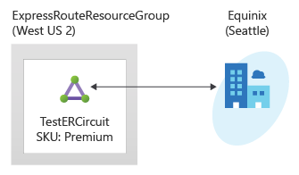
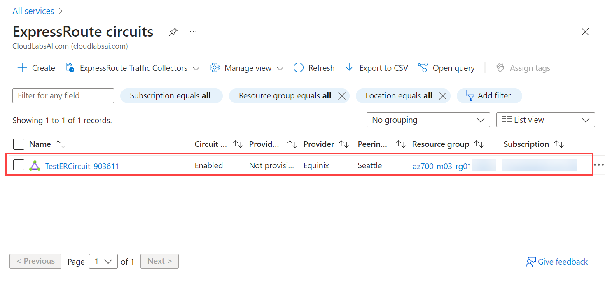
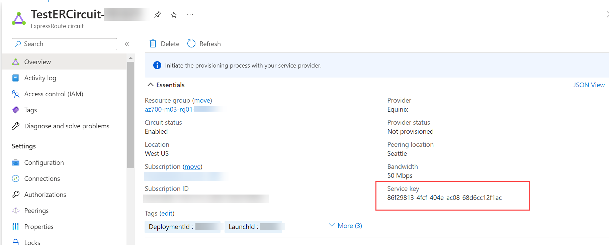
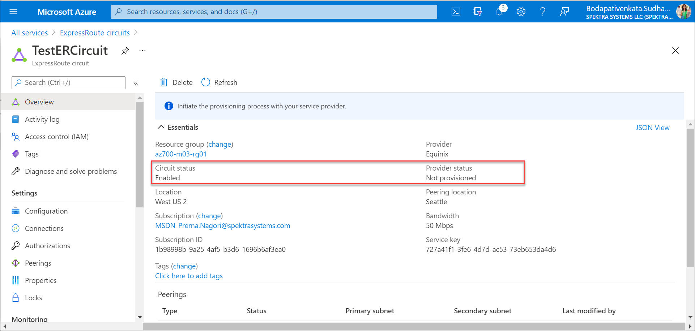

# M03-Unit 5 Provision an ExpressRoute circuit

In this exercise, you will create an ExpressRoute circuit using the Azure portal and the Azure Resource Manager deployment model. 

In this exercise, you will:

+ Task 1: Create and provision an ExpressRoute circuit
+ Task 2: Retrieve your Service key
+ Task 3: Deprovisioning an ExpressRoute circuit

## Task 1: Create and provision an ExpressRoute circuit

 
1. From a browser, navigate to the [Azure portal](https://portal.azure.com/) and sign in with username and password as provided in the Environment Details.

    **Important:** Your ExpressRoute circuit is billed from the moment a service key is issued. Ensure that you perform this operation when the connectivity provider is ready to provision the circuit.

1. On Azure Portal page, in Search resources, services and docs,  Searach and then select **ExpressRoute circuit**.
   
1. On the ExpressRoute circuits page, select **+Create**.

1. On the **Create ExpressRoute** page, select the existing resource group **az700-m03-rg01-<inject key="DeploymentID" enableCopy="false"/>**, leave the default **Region**, and Enter **Name** as **TestERCircuit-<inject key="DeploymentID" enableCopy="false"/>** for the circuit. Then select **Next: Configuration&gt;**.

    

   **Note**: Deployment ID can be obtained from environment details page.

1. When you are filling in the values on this page, make sure that you specify the correct SKU tier (Local, Standard, or Premium) and data metering billing model (Unlimited or Metered).

    .png) 

- Port type determines if you are connecting to a service provider or directly into Microsoft's global network at a peering location.
- Create new or import from classic determines if a new circuit is being created or if you are migrating a classic circuit to Azure Resource Manager.
- Provider is the internet service provider who you will be requesting your service from.
- Peering Location is the physical location where you are peering with Microsoft.

    **Important:** The Peering Location indicates the [physical location](https://docs.microsoft.com/en-us/azure/expressroute/expressroute-locations) where you are peering with Microsoft. This is not linked to "Location" property, which refers to the geography where the Azure Network Resource Provider is located. While they are not related, it is a good practice to choose a Network Resource Provider geographically close to the Peering Location of the circuit.

- **SKU** determines whether an ExpressRoute local, ExpressRoute standard, or an ExpressRoute premium add-on is enabled. You can specify **Local** to get the local SKU, **Standard** to get the standard SKU or **Premium** for the premium add-on. You can change the SKU to enable the premium add-on.

    **Important:** You cannot change the SKU from Standard/Premium to Local.

- **Billing model** determines the billing type. You can specify **Metered** for a metered data plan and **Unlimited** for an unlimited data plan. You can change the billing type from **Metered** to **Unlimited**.

    **Important:** You cannot change the type from Unlimited to Metered.

- **Allow classic operation** will allow classic virtual networks to be link to the circuit.

2. Fill the sample data as shown in above image and Click on **Review + Create** then select **Create**.

## Task 2: Retrieve your Service key
 

1. On Azure Portal page, in Search resources, services and docs,  Searach and then select **ExpressRoute circuit**.

1. All ExpressRoute circuits created in the subscription will appear here. 

    

1. The circuit page displays the properties of the circuit. The service key appears in the service key field. Your service provider will need the Service Key to complete the provisioning process. The service key is specific to your circuit. **You must send the service key to your connectivity provider for provisioning.**

    

1. On this page, **Provider status** gives you the current state of provisioning on the service-provider side. **Circuit status** provides you the state on the Microsoft side. 

1. When you create a new ExpressRoute circuit, the circuit is in the following state:

   - Provider status: Not provisioned
   - Circuit status: Enabled
   
   - The circuit changes to the following state when the connectivity provider is currently enabling it for you:
     - Provider status: Provisioning
     - Circuit status: Enabled
   - To use the ExpressRoute circuit, it must be in the following state:
     - Provider status: Provisioned
     - Circuit status: Enabled
   - You should periodically check the provisioning status and the state of the circuit key.

1. You can view the properties of the circuit that you are interested in by selecting it. Check the **Provider status** and ensure that it has moved to **Provisioned** before you continue.

    

Congratulations! You have created an ExpressRoute circuit and located the Service key, which you would need to complete the provisioning of the circuit.

## Task 3: Deprovisioning an ExpressRoute circuit

If the ExpressRoute circuit service provider provisioning state is **Provisioning** or **Provisioned,** you must work with your service provider to deprovision the circuit on their side. Microsoft can continue to reserve resources and bill you until the service provider completes deprovisioning the circuit and notifies us.

   **Note:** You must unlink all virtual networks from the ExpressRoute circuit before deprovisioning. If this operation fails, check whether any virtual networks are linked to the circuit.
    
> If the service provider has deprovisioned the circuit (the service provider provisioning state is set to Not provisioned), you can delete the circuit. This stops billing for the circuit.

