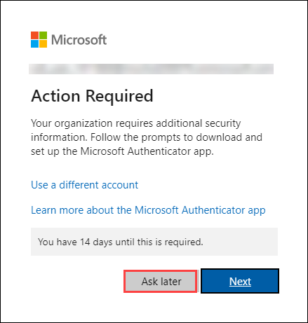

# AZ-700: Designing and Implementing Microsoft Azure Networking Solutions Workshop

## Overall Estimated Duration: 40 minutes

## Overview

In this hands-on lab, you'll create and manage virtual networks on Azure. You'll learn to design and implement networking solutions, including setting up virtual networks and configuring subnets. By the end of the lab, you'll have gained practical experience and the skills necessary to effectively manage and secure Azure networks.

## Objective
Understand how to create and manage virtual networks on Azure, configure subnets, and secure connections. By the end of this lab, you will be able to:

- *Designing and Implementing a Virtual Network in Azure* : Understand how to create and manage virtual networks and configure subnets.

## Pre-requisies

1. *Basic Networking Knowledge*: Understanding of fundamental networking concepts such as IP addressing, subnets, and routing.
2. *Azure Fundamentals*: Familiarity with the basics of Microsoft Azure, including creating and managing resources.
3. *Experience with Azure Portal*: Proficiency in navigating and using the Azure Portal to manage resources.

## Architecture

In this hands-on lab, you'll explore the deployment of three virtual networks across different regions to support various business functions. The **CoreServicesVnet** in the **East US** region hosts key resources like web services, databases, and shared services, with VPN connectivity to on-premises networks and ample address space for growth. The **ManufacturingVnet** in **West Europe** supports manufacturing operations with a large address space for numerous connected devices. The **ResearchVnet** in **Southeast Asia** caters to the research and development team with a stable set of resources and minimal growth needs. Each network is designed to meet specific organizational requirements, ensuring efficient and secure operations.

## Architecture diagram

## Explanation of Components

1. *Virtual Network*: A logically isolated network in Azure where you can launch Azure resources. It provides the foundation for your network infrastructure in the cloud.
2. *Subnets*: Subdivisions within a VNet that allow you to segment your network for better organization and security. Each subnet can host different types of resources.
 
## Getting Started with the Lab
 
Once you're ready to dive in, your virtual machine and lab guide will be right at your fingertips within your web browser.
 

### Virtual Machine & Lab Guide
 
Your virtual machine is your workhorse throughout the workshop. The lab guide is your roadmap to success.
 
## Exploring Your Lab Resources
 
To get a better understanding of your lab resources and credentials, navigate to the **Environment Details** tab.
 

 
## Utilizing the Split Window Feature
 
For convenience, you can open the lab guide in a separate window by selecting the **Split Window** button from the Top right corner.
 

 
## Managing Your Virtual Machine
 
Feel free to start, stop, or restart your virtual machine as needed from the **Resources** tab. Your experience is in your hands!
 

## **Lab Duration Extension**

1. To extend the duration of the lab, kindly click the **Hourglass** icon in the top right corner of the lab environment. 

    

    >**Note:** You will get the **Hourglass** icon when 10 minutes are remaining in the lab.

2. Click **OK** to extend your lab duration.
 
   

3. If you have not extended the duration prior to when the lab is about to end, a pop-up will appear, giving you the option to extend. Click **OK** to proceed.
 
## Let's Get Started with Azure Portal
 
1. On your virtual machine, click on the Azure Portal icon as shown below:
 
   .png)

2. You'll see the **Sign into Microsoft Azure** tab. Here, enter your credentials:
 
   - **Email/Username:** <inject key="AzureAdUserEmail"></inject>
 
       
 
3. Next, provide your password:
 
   - **Password:** <inject key="AzureAdUserPassword"></inject>
 
     
 
4. If prompted to stay signed in, you can click "No."

5. If **Action required** pop-up window appears, click on **Ask later**.
   
      
 
6. If a **Welcome to Microsoft Azure** pop-up window appears, simply click **Cancel**.
 
In this hands-on lab, you’ll create and manage virtual networks on Azure, learning to design and implement networking solutions.
 
## Support Contact

The CloudLabs support team is available 24/7, 365 days a year, via email and live chat to ensure seamless assistance at any time. We offer dedicated support channels tailored specifically for both learners and instructors, ensuring that all your needs are promptly and efficiently addressed.

Learner Support Contacts:

- Email Support: labs-support@spektrasystems.com
- Live Chat Support: https://cloudlabs.ai/labs-support

Now, click on Next from the lower right corner to move on to the next page.

.png)

## Happy Learning!!
