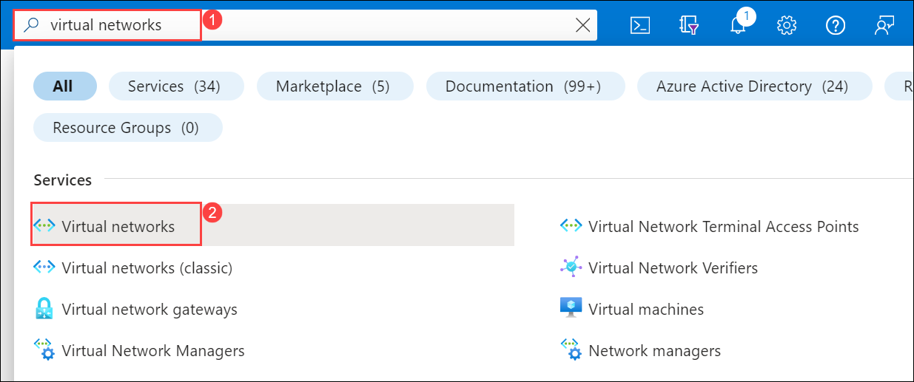
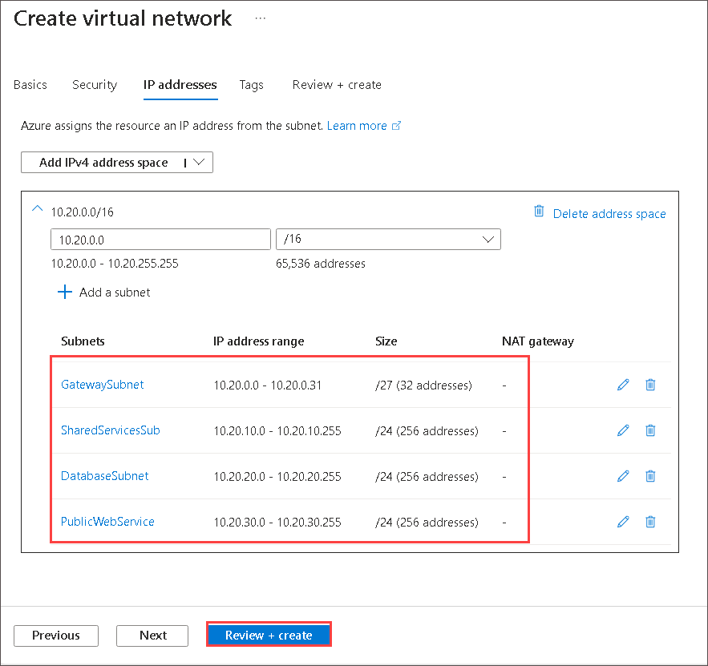
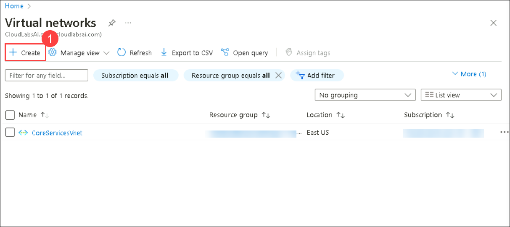

# Module 01-Unit 4 Design and implement a Virtual Network in Azure

In this hands-on lab, you will create and configure multiple virtual networks (VNets) and subnets in Azure. You will start by setting up the CoreServicesVnet, followed by the ManufacturingVnet, and finally the ResearchVnet, each with their respective subnets. This lab will guide you through the process of verifying the creation and configuration of these VNets and subnets, enhancing your skills in network architecture and management within Azure.

## Lab scenario 

Now you're ready to deploy virtual networks in the Azure portal.

Consider the fictional organization Contoso Ltd, which is in the process of migrating infrastructure and applications to Azure. In your role as network engineer, you must plan and implement three virtual networks and subnets to support resources in those virtual networks.

**Note:** An **[interactive lab simulation](https://mslabs.cloudguides.com/guides/AZ-700%20Lab%20Simulation%20-%20Design%20and%20implement%20a%20virtual%20network%20in%20Azure)** is available that allows you to click through this lab at your own pace. You may find slight differences between the interactive simulation and the hosted lab, but the core concepts and ideas being demonstrated are the same.

## Lab Objectives

In this lab, you will complete the following tasks:

+ Task 1: Create the CoreServicesVnet virtual network and subnets
+ Task 2: Create the ManufacturingVnet virtual network and subnets
+ Task 3: Create the ResearchVnet virtual network and subnets
+ Task 4: Verify the creation of VNets and Subnets

## Architecture diagram

You will create the following resources:
 

| **Virtual Network** | **Region**   | **Virtual network address space** | **Subnet**                | **Subnet**    |
| ------------------- | ------------ | --------------------------------- | ------------------------- | ------------- |
| CoreServicesVnet    | East US      | 10.20.0.0/16                      |                           |               |
|                     |              |                                   | GatewaySubnet             | 10.20.0.0/27  |
|                     |              |                                   | SharedServicesSubnet      | 10.20.10.0/24 |
|                     |              |                                   | DatabaseSubnet            | 10.20.20.0/24 |
|                     |              |                                   | PublicWebServiceSubnet    | 10.20.30.0/24 |
| ManufacturingVnet   | West Europe  | 10.30.0.0/16                      |                           |               |
|                     |              |                                   | ManufacturingSystemSubnet | 10.30.10.0/24 |
|                     |              |                                   | SensorSubnet1             | 10.30.20.0/24 |
|                     |              |                                   | SensorSubnet2             | 10.30.21.0/24 |
|                     |              |                                   | SensorSubnet3             | 10.30.22.0/24 |
| ResearchVnet        |Southeast Asia| 10.40.0.0/16                      |                           |               |
|                     |              |                                   | ResearchSystemSubnet      | 10.40.0.0/24  |

These virtual networks and subnets are structured in a way that accommodates existing resources yet allows for projected growth. Let's create these virtual networks and subnets to lay the foundation for our networking infrastructure.

### Task 1: Create the CoreServicesVnet virtual network and subnets

1. On Azure Portal page, in **Search resources, services and docs (G+/)** box at the top of the portal, enter **Virtual Networks**, and then select **Virtual Networks** under services.
   
   

1. Select **+ Create** on the Virtual networks page. 
   
1. On **Basic** tab of **Create virtual network** use the information in the following table to create the **CoreServicesVnet** virtual network and select **IP Address** tab.
 
   | **Tab**      | **Option**         | **Value**            |
   | ------------ | ------------------ | -------------------- |
   | Basics       | Subscription       | Leave default        |
   |              | Resource Group     | ContosoResourceGroup-<inject key="DeploymentID" enableCopy="false"/> |
   |              | Name               | CoreServicesVNet     |
   |              | Region             | (US) East US         |
 

1. On the **IP Address** tab of **Create virtual network** use the information:

   - Remove the default IP Address space by clicking on **Delete the address space**

     

   - After deleting **address space**, select **Add IPV4 Address space** use the information in the following table. 

     

      |    **Tab**      | **Option**         | **Value**            |
      | --------------  | -------------------- | -------------------|
      | IP Addresses    | IPv4 address space | 10.20.0.0            |
      |                 | IPv4 address Size  | /16                  |

      

1. Use the information in the following table to create the CoreServicesVnet subnets, to begin creating each subnet on the **Create virtual network** page, select **+ Add a subnet**. To finish creating each subnet, select **Add**.

    | **Subnet**             | **Option**           | **Value**              |
    | ---------------------- | -------------------- | ---------------------- |
    | GatewaySubnet          | Subnet purpose       | Select **Virtual Network Gateway** |
    |                        | Name                 | GatewaySubnet          |
    |                        | Starting address     | 10.20.0.0              |
    |                        | Size                 | /27                    |
    | SharedServicesSubnet   | Subnet name          | SharedServicesSubnet   |
    |                        | Starting address     | 10.20.10.0             |
    |                        | Size                 | /24                    |
    | DatabaseSubnet         | Subnet name          | DatabaseSubnet         |
    |                        | Starting address     | 10.20.20.0             |
    |                        | Size                 | /24                    |
    | PublicWebServiceSubnet | Subnet name          | PublicWebServiceSubnet |
    |                        | Starting address     | 10.20.30.0             |
    |                        | Size                 | /24                    |

1. To finish creating the CoreServicesVnet and its associated subnets, select **Review + create**, and select **Create**.

      

1. Once, the creation of the **CoreServicesVnet** is completed, select **Go to resource**.

1. Verify your configuration passed validation, Go back to virtual network and then again select **+ Create**.

    
 
1. Repeat steps 1 -8 for each VNet based on the tables below mentioned in **Task 2** and **Task3**.

     > **Congratulations** on completing the task! Now, it's time to validate it. Here are the steps:
     > - Navigate to the Lab Validation Page, from the upper right corner in the lab guide section.
     > - Hit the Validate button for the corresponding task. You can proceed to the next task if you receive a success message.
     > - If not, carefully read the error message and retry the step, following the instructions in the lab guide.
     > - If you need any assistance, please contact us at labs-support@spektrasystems.com. We are available 24/7 to help you out.
 
      <validation step="d51cb8e1-a452-4f19-86d3-a6bb63c41bb1" />
    
### Task 2: Create the ManufacturingVnet virtual network and subnets

1. On **Basic** tab of **Create virtual network** use the information in the following table to create the **ManufacturingVnet** virtual network and select **IP 
   Address** tab.

   | **Tab**      | **Option**         | **Value**             |
   | ------------ | ------------------ | --------------------- |
   | Basics       | Resource Group     | ContosoResourceGroup-<inject key="DeploymentID" enableCopy="false"/>  |
   |              | Name               | ManufacturingVnet     |
   |              | Region             | (Europe) West Europe  |

1. **Go to Ip address tab** Delete the existing ip address in the IP adress Tab and add the below ip adress with the subnets as performed in the previous task.   

    | **IP/Subnet**                | **Option**           | **Value**                 |
    | ------------------------- | -------------------- | ------------------------- |
    | IP Addresses              | IPv4 address space   | 10.30.0.0/16              |
    | ManufacturingSystemSubnet | Name                 | ManufacturingSystemSubnet |
    |                           | Starting address     | 10.30.10.0                |
    |                           | Size                 | /24                       |
    | SensorSubnet1             | Name                 | SensorSubnet1             |
    |                           | Starting address     | 10.30.20.0                |
    |                           | Size                 | /24                       |
    | SensorSubnet2             | Name                 | SensorSubnet2             |
    |                           | Starting address     | 10.30.21.0                |
    |                           | Size                 | /24                       |
    | SensorSubnet3             | Name                 | SensorSubnet3             |
    |                           | Starting address     | 10.30.22.0                |
    |                           | Size                 | /24                       |

1. To finish creating the CoreServicesVnet and its associated subnets, select **Review + create**, and select **Create**.

1. Verify your configuration passed validation, Go back to virtual network and then again select **+ Create**.

    <validation step="78f4c13b-e110-4236-9f30-a8bcbbf5d2a5" />
    
    > **Congratulations** on completing the task! Now, it's time to validate it. Here are the steps:
     > - Navigate to the Lab Validation Page, from the upper right corner in the lab guide section.
     > - Hit the Validate button for the corresponding task. You can proceed to the next task if you receive a success message.
     > - If not, carefully read the error message and retry the step, following the instructions in the lab guide.
     > - If you need any assistance, please contact us at labs-support@spektrasystems.com. We are available 24/7 to help you out.

### Task 3: Create the ResearchVnet virtual network and subnets

1. On **Basic** tab of **Create virtual network** use the information in the following table to create the **ResearchVnet** virtual network and select **IP 
   Address** tab.

   | **Tab**      | **Option**         | **Value**            |
   | ------------ | ------------------ | -------------------- |
   | Basics       | Resource Group     | ContosoResourceGroup-<inject key="DeploymentID" enableCopy="false"/> |
   |              | Name               | ResearchVnet         |
   |              | Region             | Southeast Asia       |

1. **Go to Ip address tab** Delete the existing ip address in the IP adress Tab and add the below ip adress with the subnets as performed in the previous task.    

   | **IP/Subnet**        | **Option**           | **Value**            |
   | -------------------- | -------------------- | -------------------- |
   | IP Addresses         | IPv4 address space   | 10.40.0.0/16         |
   | ResearchSystemSubnet | Name                 | ResearchSystemSubnet |
   |                      | Starting address     | 10.40.0.0            |
   |                      | Size                 | /24                  |

1. To finish creating the CoreServicesVnet and its associated subnets, select **Review + create**, and select **Create**.
 
    <validation step="69271e47-83aa-448c-896f-5d5a42ba4ee0" /> 

    > **Congratulations** on completing the task! Now, it's time to validate it. Here are the steps:
     > - Navigate to the Lab Validation Page, from the upper right corner in the lab guide section.
     > - Hit the Validate button for the corresponding task. You can proceed to the next task if you receive a success message.
     > - If not, carefully read the error message and retry the step, following the instructions in the lab guide.
     > - If you need any assistance, please contact us at labs-support@spektrasystems.com. We are available 24/7 to help you out.

### Task 4: Verify the creation of VNets and Subnets

1. On the Azure portal home page, from top left corner of page click **Show portal** menu and select **All resources**.

   

1. Verify that the CoreServicesVnet, ManufacturingVnet, and ResearchVnet are listed.

1. Select **CoreServicesVnet**. 

1. In CoreServicesVnet, from the left navigation pane, under **Settings**, select **Subnets**.

1. In CoreServicesVnet | Subnets, verify that the subnets you created are listed, and that the IP address ranges are correct.

   

1. Repeat steps 3 - 5 and select **ManufacturingVnet**, and **ResearchVnet** Virtual Network to verify the subnets.

## Review

In this lab, you have completed:

+ Creating the CoreServicesVnet virtual network and subnets
+ Creating the ManufacturingVnet virtual network and subnets
+ Creating the ResearchVnet virtual network and subnets
+ Verifying the creation of VNets and Subnets

## You have successfully completed the lab.
