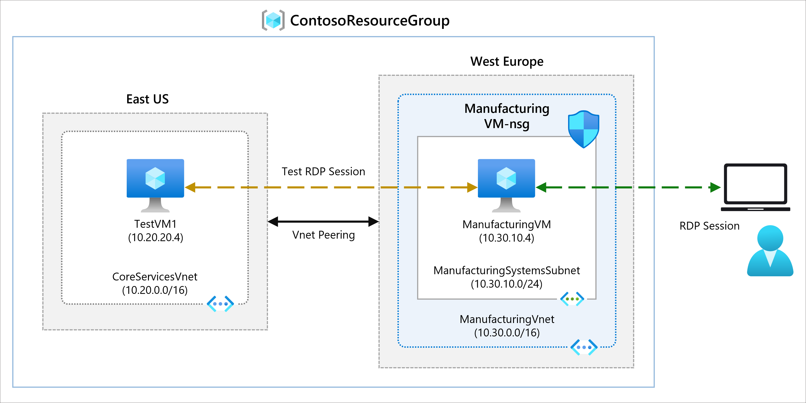
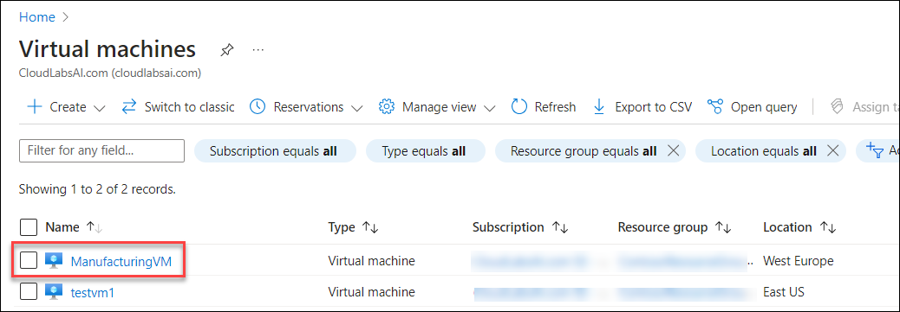
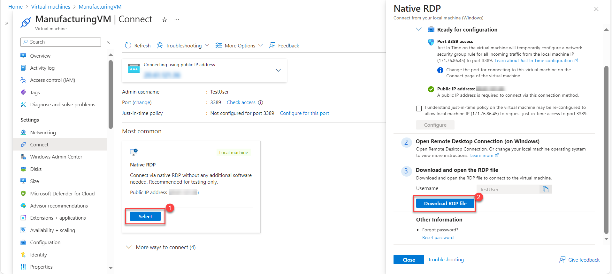
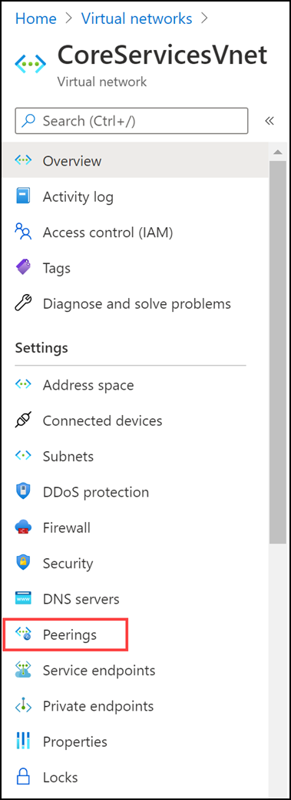

# Module 01-Unit 8 Connect two Azure Virtual Networks using global virtual network peering

## Lab scenario 
In this lab, you will configure connectivity between the CoreServicesVnet and the ManufacturingVnet by adding peerings to allow traffic flow. 

## Lab Objective

In this lab, you will complete the following tasks:

+ Task 1: Create a Virtual Machine to test the configuration
+ Task 2: Connect to the Test VMs using RDP
+ Task 3: Test the connection between the VMs
+ Task 4: Create VNet peerings between CoreServicesVnet and ManufacturingVnet
+ Task 5: Test the connection between the VMs

**Note:** An **[interactive lab simulation](https://mslabs.cloudguides.com/guides/AZ-700%20Lab%20Simulation%20-%20Connect%20two%20Azure%20virtual%20networks%20using%20global%20virtual%20network%20peering)** is available that allows you to click through this lab at your own pace. You may find slight differences between the interactive simulation and the hosted lab, but the core concepts and ideas being demonstrated are the same.

## Estimated time: 20 minutes

## Architecture diagram

   ‎

### Task 1: Create a Virtual Machine to test the configuration

In this section, you will create a test VM on the Manufacturing VNet to test if you can access resources inside another Azure virtual network from your ManufacturingVnet.

#### Create ManufacturingVM

1. On the Azure portal select the **Cloud shell** (**[>_]**)  button at the top of the page to the right of the search box. This opens a cloud shell pane at the bottom of the portal.

   

1. The first time you open the Cloud Shell, you may be prompted to choose the type of shell you want to use (*Bash* or *PowerShell*). If so, select **PowerShell**.

   
   
1. If you are prompted to create storage for your Cloud Shell, ensure your subscription is selected and click on **Show advanced settings**.

1. Please make sure you have selected your resource group **ContosoResourceGroup-<inject key="DeploymentID" enableCopy="false"/>**.

1. Enter **blob<inject key="DeploymentID" enableCopy="false"/>** for the **Storage account**.

1. Enter **blobfileshare<inject key="DeploymentID" enableCopy="false"/>** for the  **File share** , then click on **Create Storage**.

1. On the toolbar of the Cloud Shell pane, select the **Upload/Download files** icon, in the drop-down menu, select **Upload**.

   
   
1. Upload the following files **ManufacturingVMazuredeploy.json** and **ManufacturingVMazuredeploy.parameters.json** into the Cloud Shell home directory one by one from the source folder **C:\AllFiles\AZ-700-Designing-and-Implementing-Microsoft-Azure-Networking-Solutions-prod\Allfiles\Exercises\M01**.

1. Deploy the following ARM templates to create the VMs needed for this exercise:

   **Important**: Please replace ContosoResourceGroup-(DID) with **ContosoResourceGroup-<inject key="DeploymentID" enableCopy="false"/>**

   ```powershell
   $RGName = "ContosoResourceGroup-(DID)"
   
   New-AzResourceGroupDeployment -ResourceGroupName $RGName -TemplateFile ManufacturingVMazuredeploy.json -TemplateParameterFile ManufacturingVMazuredeploy.parameters.json
   ```

1. You will be prompted to provide an Admin password. Provide Admin password Password: **Pa$$w0rd1234**.   
   
1. When the deployment is complete, go to the Azure portal home page, and then select **Virtual Machines**.

1. Verify that the virtual machine has been created.

   


   > **Congratulations** on completing the task! Now, it's time to validate it. Here are the steps:
   > - Navigate to the Lab Validation Page, from the upper right corner in the lab guide section.
   > - Hit the Validate button for the corresponding task. You can proceed to the next task if you receive a success message.
   > - If not, carefully read the error message and retry the step, following the instructions in the lab guide.
   > - If you need any assistance, please contact us at labs-support@spektrasystems.com. We are available 24/7 to help you out.

## Task 2: Connect to the Test VMs using RDP

1. On the Azure Portal home page, select **Virtual Machines**.

1. Select **ManufacturingVM**.

1. On ManufacturingVM, select **Connect** .

   

1. On ManufacturingVM | Connect, select **Download RDP file**.

   

1. Save the RDP file to your desktop. If any warning pops-up in "edge downloads" select **keep**

1. Connect to ManufacturingVM using the RDP file, and the username **TestUser** and the password **Pa$$w0rd1234** you provided during deployment.

1. On the Azure Portal home page, select **Virtual Machines**.

1. Select **TestVM1**.

1. On TestVM1, select **Connect** 

   

1. On **TestVM1 | Connect** page, under **Native RDP** click on **Select** and on **Native RDP** window select and **Download RDP file**. 

   .png)

1. Save the RDP file to your desktop.

1. Connect to TestVM1 using the RDP file, and the username **TestUser** and the password **Pa$$w0rd1234** .

1. On both VMs, in **Choose privacy settings for your device**, select **Accept**.

1. On both VMs, in **Networks**, select **Yes**.

1. On TestVM1, Right click on start and select windows PowerShell, and run the following command: **ipconfig**

1. Note the IPv4 address. 

## Task 3: Test the connection between the VMs

1. On the ManufacturingVM, Right click on start and select windows PowerShell.

1. Use the following command to verify that there is no connection to TestVM1 on CoreServicesVnet. Be sure to use the IPv4 address for TestVM1.

   ```powershell
    Test-NetConnection 10.20.20.4 -port 3389
    ```

1. The test connection should fail, and you will see a result similar to the following:

   

## Task 4: Create VNet peerings between CoreServicesVnet and ManufacturingVnet

1. On the Azure home page, select **Virtual Networks**, and then select **CoreServicesVnet**.

1. In CoreServicesVnet, under **Settings**, select **Peerings**.

   

1. On CoreServicesVnet | Peerings, select **+ Add**.

1. Use the information in the following table to create the peering.

   | **Section**                          | **Option**                                    | **Value**                             |
   | ------------------------------------ | --------------------------------------------- | ------------------------------------- |
   | This virtual network                 |                                               |                                       |
   |                                      | Peering link name                             | CoreServicesVnet-to-ManufacturingVnet |
   |                                      | Traffic to remote virtual network             | Allow (default)                       |
   |                                      | Traffic forwarded from remote virtual network | Allow (default)                       |
   |                                      | Virtual network gateway or Route Server       | None (default)                        |
   | Remote virtual network               |                                               |                                       |
   |                                      | Peering link name                             | ManufacturingVnet-to-CoreServicesVnet |
   |                                      | Virtual network deployment model              | Resource manager                      |
   |                                      | I know my resource ID                         | Not selected                          |
   |                                      | Subscription                                  | Select the Subscription provided      |
   |                                      | Virtual network                               | ManufacturingVnet                     |
   |                                      | Traffic to remote virtual network             | Allow (default)                       |
   |                                      | Traffic forwarded from remote virtual network | Allow (default)                       |
   |                                      | Virtual network gateway or Route Server       | None (default)                        |

1. Review your settings and select **Add**. 

1. In CoreServicesVnet | Peerings, verify that the **CoreServicesVnet-to-ManufacturingVnet** peering is listed.

1. Under Virtual networks, select **ManufacturingVnet**, and verify the **ManufacturingVnet-to-CoreServicesVnet** peering is listed.

   > **Congratulations** on completing the task! Now, it's time to validate it. Here are the steps:
   > - Navigate to the Lab Validation Page, from the upper right corner in the lab guide section.
   > - Hit the Validate button for the corresponding task. You can proceed to the next task if you receive a success message.
   > - If not, carefully read the error message and retry the step, following the instructions in the lab guide.
   > - If you need any assistance, please contact us at labs-support@spektrasystems.com. We are available 24/7 to help you out.

## Task 5: Test the connection between the VMs

1. On the ManufacturingVM, open a PowerShell prompt.

1. Use the following command to verify that there is now a connection to TestVM1 on CoreServicesVnet. 

   ```powershell
    Test-NetConnection 10.20.20.4 -port 3389
    ```

1. The test connection should succeed, and you will see a result similar to the following:

   

## Review

In this lab, you have completed:

+ Creating a Virtual Machine to test the configuration
+ Connecting to the Test VMs using RDP
+ Testing the connection between the VMs
+ Creating VNet peerings between CoreServicesVnet and ManufacturingVnet
+ Testing the connection between the VMs

## You have successfully completed the lab.

