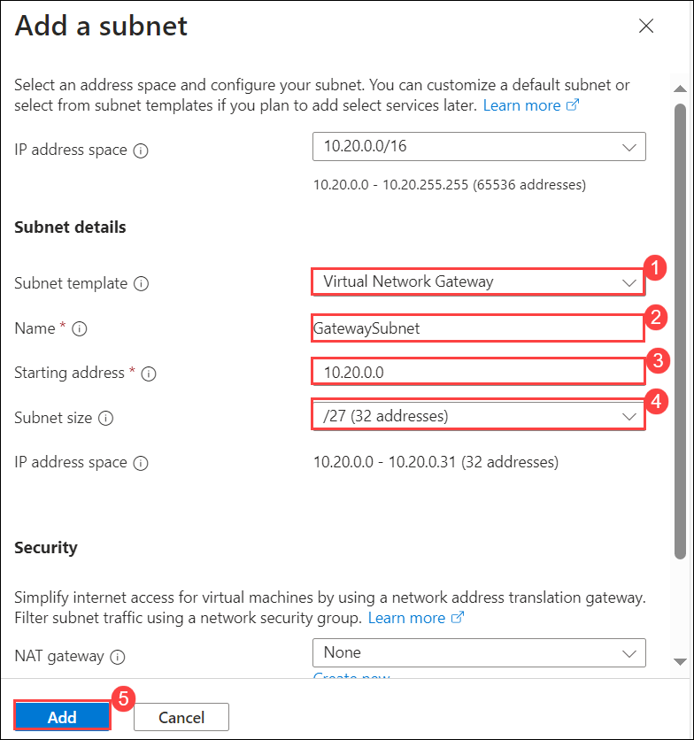

# Module 03-Unit 4 Configure an ExpressRoute Gateway

## Deploy ExpressRoute gateways

To connect your Azure virtual network and your on-premises network via ExpressRoute, you must create a virtual network gateway first. A virtual network gateway serves two purposes: to exchange IP routes between the networks and to route network traffic. 

**Note:** An **[interactive lab simulation](https://mslabs.cloudguides.com/guides/AZ-700%20Lab%20Simulation%20-%20Configure%20an%20ExpressRoute%20gateway)** is available that allows you to click through this lab at your own pace. You may find slight differences between the interactive simulation and the hosted lab, but the core concepts and ideas being demonstrated are the same.

#### Estimated time: 60 minutes (includes ~45 minutes deployment waiting time)

**Gateway types**

When you create a virtual network gateway, you need to specify several settings. One of the required settings, '-GatewayType', specifies whether the gateway is used for ExpressRoute, or VPN traffic. The two gateway types are:

- **VPN** - To send encrypted traffic across the public Internet, you use the gateway type 'VPN'. This is also referred to as a VPN gateway. Site-to-Site, Point-to-Site, and VNet-to-VNet connections all use a VPN gateway.
- **ExpressRoute** - To send network traffic on a private connection, you use the gateway type 'ExpressRoute'. This is also referred to as an ExpressRoute gateway and is the type of gateway used when configuring ExpressRoute.

Each virtual network can have only one virtual network gateway per gateway type. For example, you can have one virtual network gateway that uses -GatewayType VPN, and one that uses -GatewayType ExpressRoute.

In this exercise, you will:

+ Task 1: Create the VNet and gateway subnet
+ Task 2: Create the virtual network gateway

## Task 1: Create the VNet and gateway subnet

1. On any Azure Portal page, in **Search resources, services and docs**, enter virtual network, and then select **Virtual networks** from the results.

1. On the Virtual networks page, select **+Create**.

1. On the Create virtual networks pane, on the **Basics** tab, use the information in the following table to create the VNet:

   | **Setting**          | **Value**                        |
   | -------------------- | -------------------------------- |
   | Subscription         | Leave default                    |
   | Resource Group       | **ContosoResourceGroup-<inject key="DeploymentID" enableCopy="false"/>**|
   | Virtual Network Name | CoreServicesVNet                 |
   | Location             | East US                          |

1. Select **Next : IP addresses**.

1. On the **IP Addresses** tab, click on **Add IPv4 address space** **(1)**, enter 10.20.0.0  **(2)** in address space field and enter /16 **(3)** size, then select **+ Add subnet** **(4)**. 

   

1. In the Add subnet pane, use the information in the following table to create the subnet:

   | **Setting**                  | **Value**     |
   | ---------------------------- | ------------- |
   | Subnet template              | Select **Virtual Network Gateway** |
   | Name                         |GatewaySubnet  |
   | Starting address             | 10.20.0.0     |
   | Subnet size                  | /27           |

1. And then select **Add**.

   

1. On the Create virtual network page, select **Review + Create**.

1. Confirm that the VNet passes the validation and then select **Create**.

   **Note**: If you are using a dual stack virtual network and plan to use IPv6-based private peering over ExpressRoute, select Add IP6 address space and input IPv6 address range values.

## Task 2: Create the virtual network gateway

1. On any Azure Portal page, in **Search resources, services and docs (G+/)**, enter virtual network gateway, and then select **Virtual network gateways** from the results.

1. On the Virtual network gateways page, select **+ Create**.

1. On the **Create virtual network gateway** page, use the information in the following table to create the gateway:

   | **Setting**               | **Value**                  |
   | ------------------------- | -------------------------- |
   | **Project details**       |                            |
   | Resource Group            | **ContosoResourceGroup-<inject key="DeploymentID" enableCopy="false"/>**       |
   | **Instance details**      |                            |
   | Name                      | CoreServicesVnetGateway    |
   | Region                    | East US                    |
   | Gateway type              | ExpressRoute               |
   | SKU                       | Standard                   |
   | Virtual network           | CoreServicesVNet           |
   | **Public IP address**     |                            |
   | Public IP address         | Create new                 |
   | Public IP address name    | CoreServicesVnetGateway-IP |
   | Public IP address SKU     | Basic                      |
   | Assignment                | Not configurable           |
   
1. Select **Review + Create**.

1. Confirm that the Gateway configuration passes validation and then select **Create**.

1. When the deployment is complete, select **Go to Resource**.

   **Note**: it can take up to 45 minutes to deploy a Gateway.

   Congratulations! You have successfully created a Virtual network, a gateway subnet, and an ExpressRoute Gateway.

## You have successfully completed the lab.
