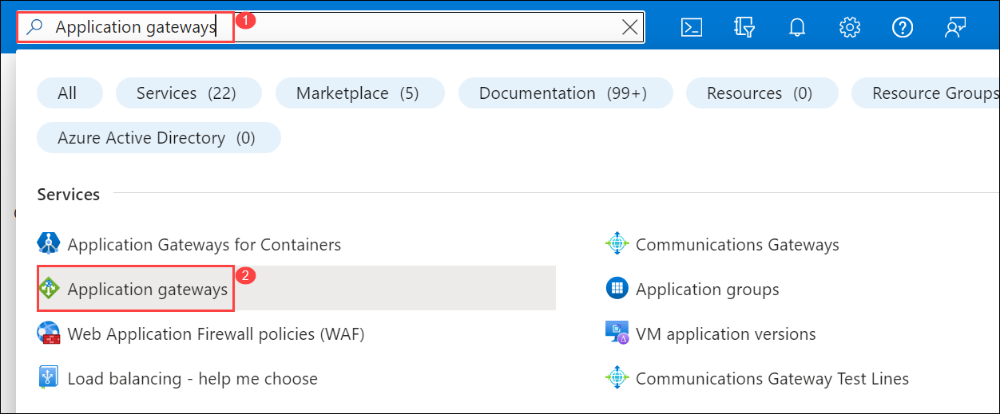
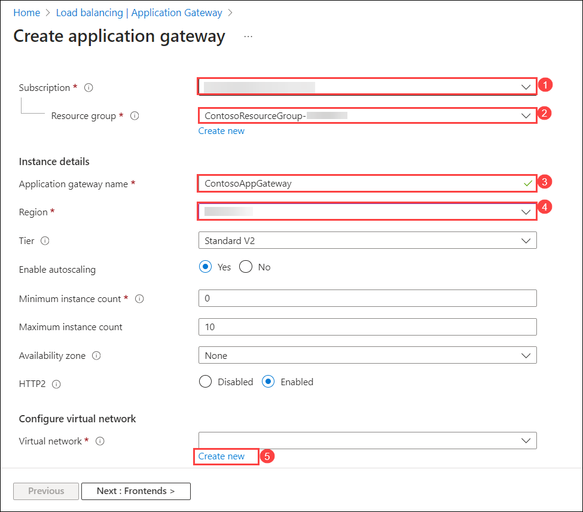
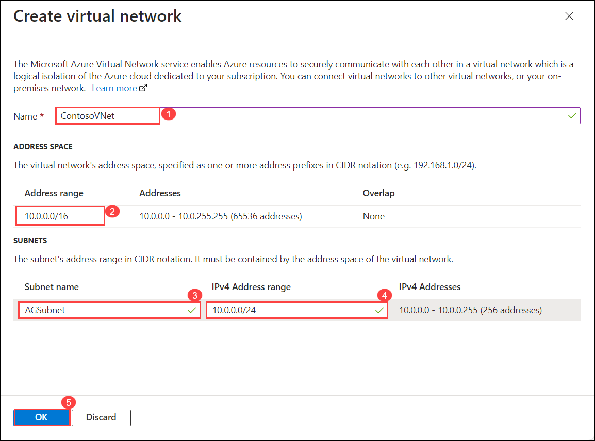
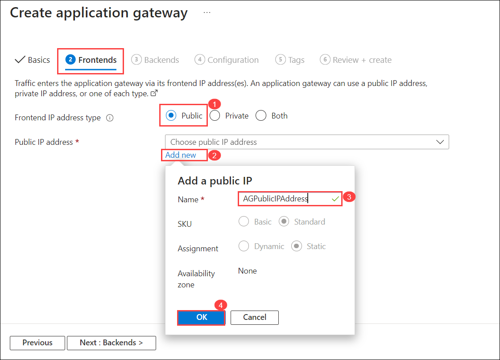
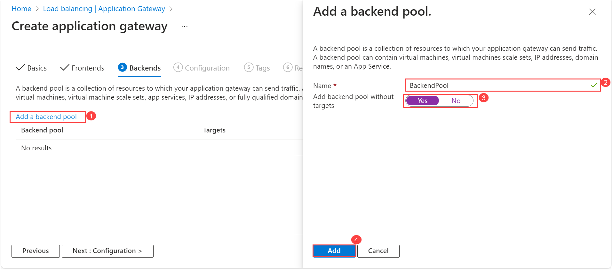
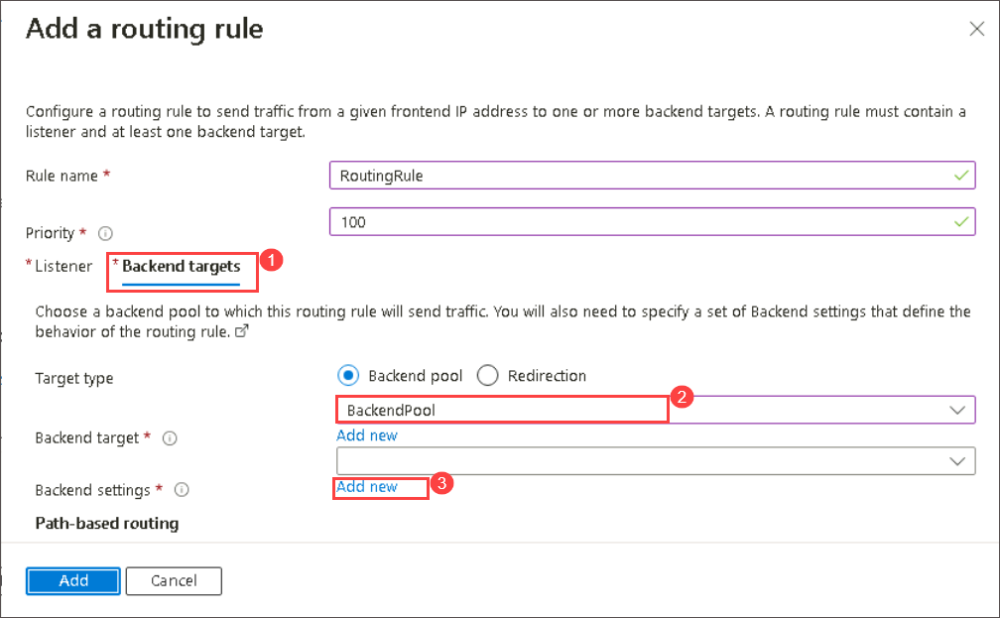
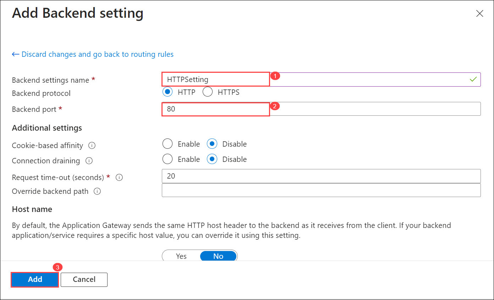
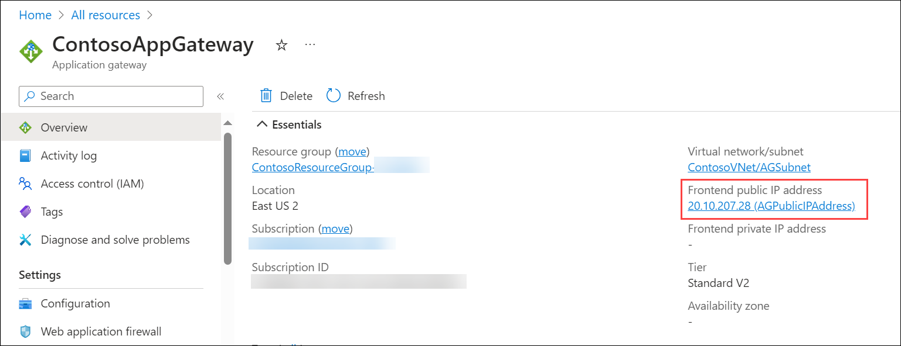

# Module 05: Unit 4 - Deploy Azure Application Gateway

## Lab scenario 

In this lab, you use the Azure portal to create an application gateway. Then you test it to make sure it works correctly.

>**Note**: An **[interactive lab simulation](https://mslabs.cloudguides.com/guides/AZ-700%20Lab%20Simulation%20-%20Deploy%20Azure%20Application%20Gateway)** is available that allows you to click through this lab at your own pace. You may find slight differences between the interactive simulation and the hosted lab, but the core concepts and ideas being demonstrated are the same.

The application gateway directs application web traffic to specific resources in a backend pool. You assign listeners to ports, create rules, and add resources to a backend pool. For the sake of simplicity, this article uses a simple setup with a public front-end IP, a basic listener to host a single site on the application gateway, a basic request routing rule, and two virtual machines in the backend pool.

For Azure to communicate between the resources that you create, it needs a virtual network. You can either create a new virtual network or use an existing one. In this example, you'll create a new virtual network while you create the application gateway. Application Gateway instances are created in separate subnets. You create two subnets in this example: one for the application gateway, and another for the backend servers.

## Lab Objectives
In this lab, you will complete the following tasks:

+ Task 1: Create an application gateway
+ Task 2: Create virtual machines
+ Task 3: Add backend servers to backend pool
+ Task 4: Test the application gateway

## Estimated time: 25 minutes

## Architecture diagram

      

## Task 1: Create an application gateway

1. On Azure Portal page, in **Search resources, services and docs (G+/)**, enter application gateway, and then select **Application gateways** from the results.
        

1. On the **Load balancing | Application Gateway** page, select **+ Create**.

1. On the Create application gateway **Basics** tab, enter, or select the following information:

   | **Setting**         | **Value**                                    |
   | ------------------- | -------------------------------------------- |
   | Subscription        | Select your subscription.                    |
   | Resource group      | Select ContosoResourceGroup-<inject key="DeploymentID" enableCopy="false"/>       |
   | Application Gateway | ContosoAppGateway                            |
   | Region              | **<inject key="Region" enableCopy="false"/>**                           |
   | Virtual Network     | Select **Create new**                        |
   |||

   

   
1. In Create virtual network, enter, or select the following information:

   | **Setting**       | **Value**                          |
   | ----------------- | ---------------------------------- |
   | Name              | ContosoVNet                        |
   | **ADDRESS SPACE** |                                    |
   | Address range     | 10.0.0.0/16                        |
   | **SUBNETS**       |                                    |
   | Subnet name       | Change **default** to **AGSubnet** |
   | Address range     | 10.0.0.0/24                        |
   |||

   
   
1. Select **OK** to return to the Create application gateway Basics tab.

1. Accept the default values for the other settings and then select **Next: Frontends**.

1. On the **Frontends** tab, verify **Frontend IP address type** is set to **Public**.

1. Select **Add new** for the **Public IP address** and enter **AGPublicIPAddress** for the public IP address name, and then select **OK**.

   

1. Select **Next: Backends**.

1. On the **Backends** tab, select **Add a backend pool**.

1. On the **Add a backend pool** window that opens, enter the following values to create an empty backend pool:

    | **Setting**                      | **Value**   |
    | -------------------------------- | ----------- |
    | Name                             | BackendPool |
    | Add backend pool without targets | Yes         |
    |||

    

 
1. On the **Add a backend pool** window, select **Add** to save the backend pool configuration and return to the **Backends** tab.

1. On the **Backends** tab, select **Next: Configuration**.

1. On the **Configuration** tab, you'll connect the frontend and backend pool you created using a routing rule.

1. On the **Routing rules** column, select **+ Add a routing rule**.

1. On **Add a routing rule** window, enter or select the following information:

    | **Setting**   | **Value**         |
    | ------------- | ----------------- |
    | **Rule name** | **RoutingRule**   |
    | **Priority**  | **100**           |
    |||

    

    
1. On the **Listener** tab, enter or select the following information:

    | **Setting**   | **Value**         |
    | ------------- | ----------------- |
    | Listener name | Listener          |
    | Frontend IP   | Select **Public** |
    |||

    


1. Accept the default values for the other settings on the **Listener** tab.

1. Select the **Backend targets** tab to configure the rest of the routing rule.

1. On the **Backend targets** tab, enter or select the following information:

    | **Setting**      | **Value**      |
    | -------------    | -------------- |
    | Target type      | Select Backendpool in drop down  |
    | Backend Settings | **Add new** |
    |||

      

1. In **Add a Backend Setting**, enter or select the following information:

    | **Setting**          | **Value**   |
    | ------------------   | ----------- |
    | Backend setting name | HTTPSetting |
    | Backend port         | 80          |
    |||

      

1. Accept the default values for the other settings in the **Add a Backend Setting** window, then select **Add** to return to **Add a routing rule**.

1. Select **Add** to save the routing rule and return to the **Configuration** tab.

1. Select **Next: Tags** and then **Next: Review + create**.

1. Review the settings on the **Review + create** tab

1. Select **Create** to create the virtual network, the public IP address, and the application gateway.

    > **Note**:  It may take 5 minutes for Azure to create the application gateway. Wait until the deployment finishes successfully before moving on to the next section.
   
1. On any Azure Portal page, in **Search resources, services and docs (G+/)**, enter Virtual networks, and then select **Virtual networks** from the results.

1. On the Virtual networks page select **ContosoVNet**. 
 
1. On the ContosoVNet page from left side menu under Settings and click **Subnet**.

1. On the ContosoVNet | Subnets page select **+ Subnet**. 

1. On Add subnet page fill the follwing details(leave other field as default) and click on **save**.

    | **Setting**           | **Value**   |
    | --------------------- | ----------- |
    | Name                  | BackendSubnet |
    | Subnet address range  | 10.0.1.0/24 |
    |||

      

## Task 2: Create virtual machines

1. On the Azure portal, select the **Cloud shell** (**[>_]**)  button at the top of the page to the right of the search box. This opens a cloud shell pane at the bottom of the portal.

   

1. The first time you open the Cloud Shell, you may be prompted to choose the type of shell you want to use (*Bash* or *PowerShell*). If so, select **PowerShell**.

   

1. If you are prompted to create storage for your Cloud Shell, ensure your subscription is selected and click on **Show advanced settings**. Please make sure you have selected your resource group **ContosoResourceGroup-<inject key="DeploymentID" enableCopy="false"/>** and enter **blob<inject key="DeploymentID" enableCopy="false"/>** for the **Storage account** and enter **blobfileshare<inject key="DeploymentID" enableCopy="false"/>** for the  **File share** , then click on **Create Storage**.


1. On the toolbar of the Cloud Shell pane, select the **Upload/Download files** icon, in the drop-down menu, select **Upload** and upload the following files **backend.json** and **backend.parameters.json** into the Cloud Shell home directory one by one from the source folder **C:\AllFiles\AZ-700-Designing-and-Implementing-Microsoft-Azure-Networking-Solutions-prod\Allfiles\Exercises\M05**.

      

1. Deploy the following ARM templates to create the VMs needed for this exercise:

     **Important**: Please replace ContosoResourceGroup-(DID) with **ContosoResourceGroup-<inject key="DeploymentID" enableCopy="false"/>**
   

   ```powershell
   $RGName = "ContosoResourceGroup-DID"
   
   New-AzResourceGroupDeployment -ResourceGroupName $RGName -TemplateFile backend.json -TemplateParameterFile backend.parameters.json
   ```
1. You will be prompted to provide an Admin password. Provide Admin password Password: Pa55w.rd!!
  
1. When the deployment is complete, go to the Azure portal home page, and then select **Virtual Machines**.

1. Verify that both virtual machines have been created.

## Task 3: Add backend servers to backend pool

1. On the Azure portal menu, select **All resources** or search for and select All resources. Then select **ContosoAppGateway**.

1. Under **Settings**, select **Backend pools**.

1. Select **BackendPool**.

1. On the Edit backend pool page, under **Backend targets**, in **Target type**, select **Virtual machine**.

1. Under **Target**, select **BackendVM1.nic.** 

1. On **Target type**, select **Virtual machine**.

1. Under **Target**, select **BackendVM2.nic.**
   
1. Select **Save**.

    .png)  

    **Note**: Wait for the deployment to complete before proceeding to the next step.

## Task 4: Test the application gateway

Although IIS isn't required to create the application gateway, you installed it in this exercise to verify if Azure successfully created the application gateway.

### Use IIS to test the application gateway:

1. On the application gateway navigate to **Overview** page and find the public IP address. 

      

1. Copy the public IP address, and then paste it into the address bar of your browser to browse that IP address.

1. Check the response. A valid response verifies that the application gateway was successfully created and can successfully connect with the backend.

   

1. Refresh the browser multiple times and you should see connections to both BackendVM1 and BackendVM2.

   Congratulations! You have configured and tested an Azure Application Gateway.

### Review
In this lab, you have completed:

- Create an application gateway
- Create virtual machines
- Add backend servers to backend pool
- Test the application gateway

## You have successfully completed the lab.

