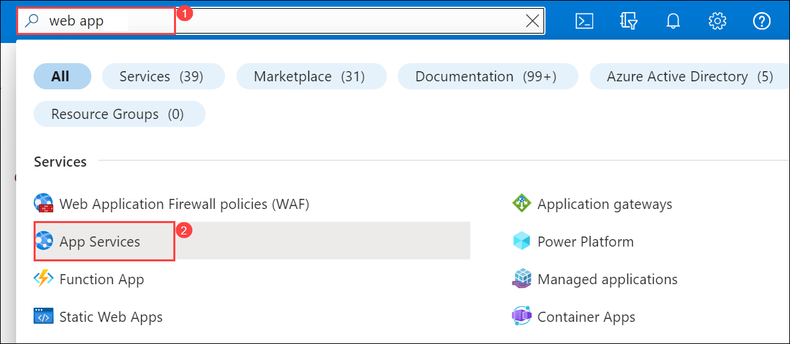
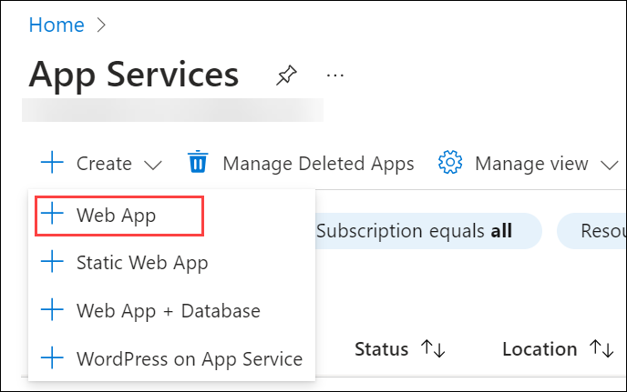
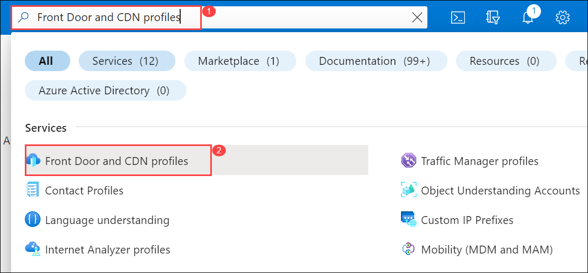
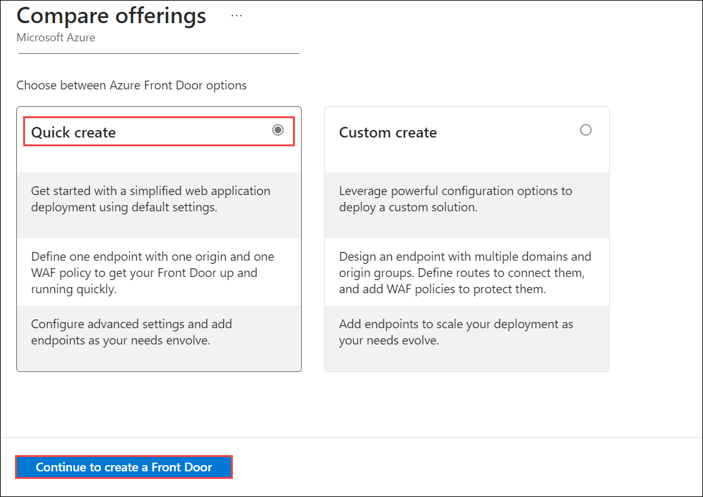
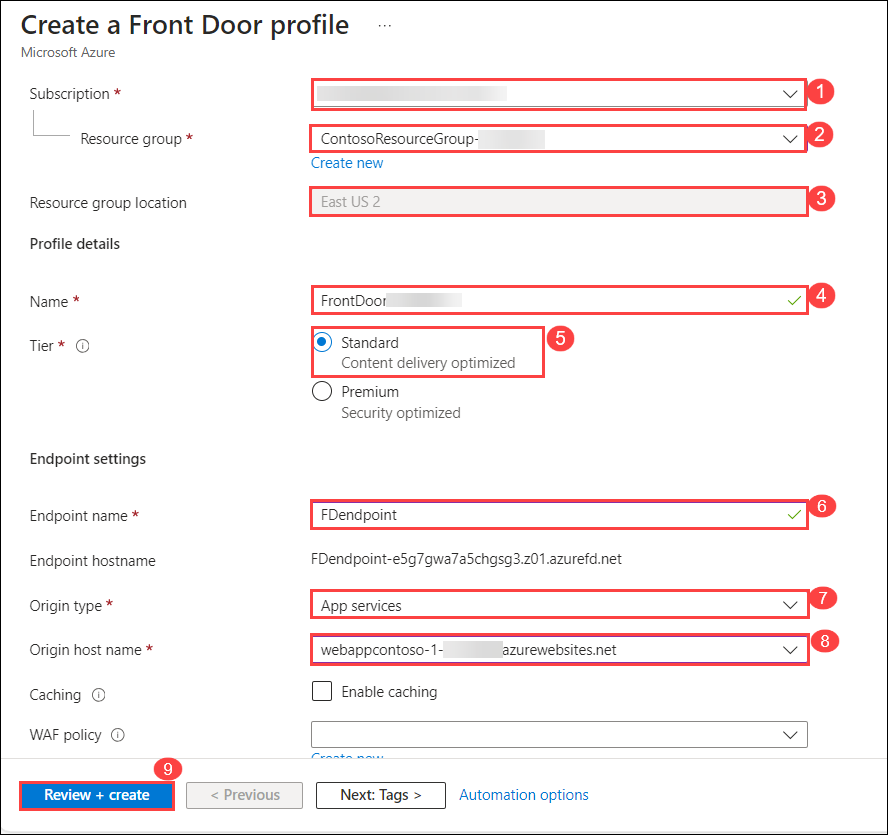
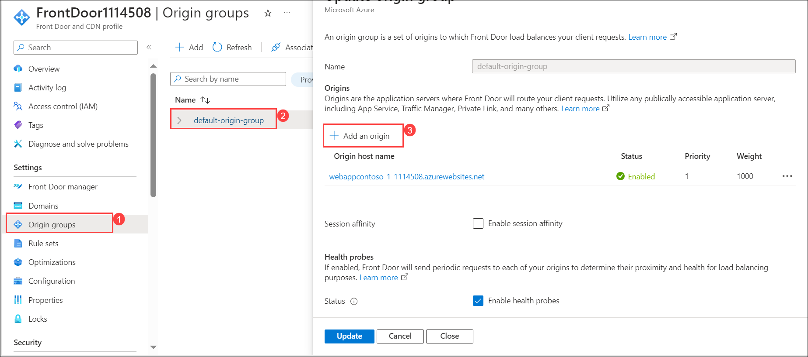
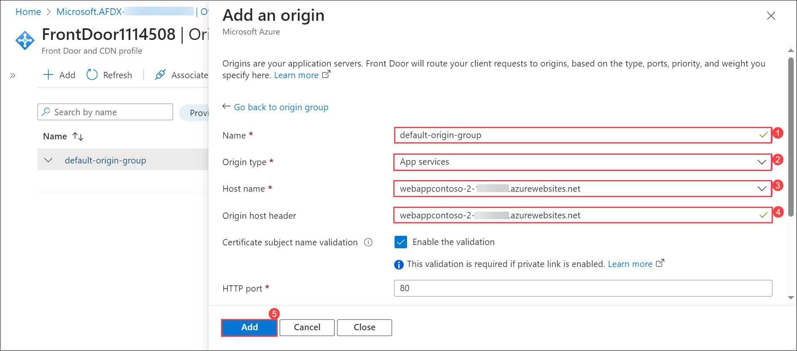
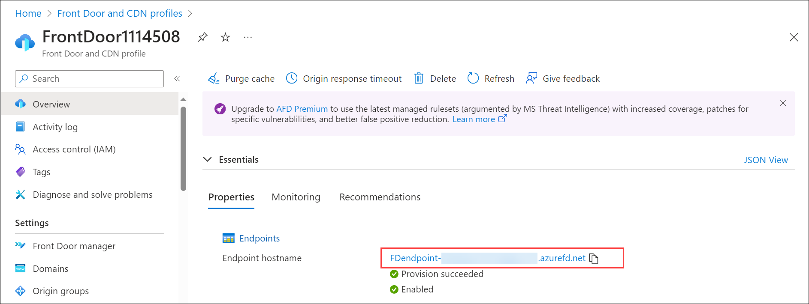
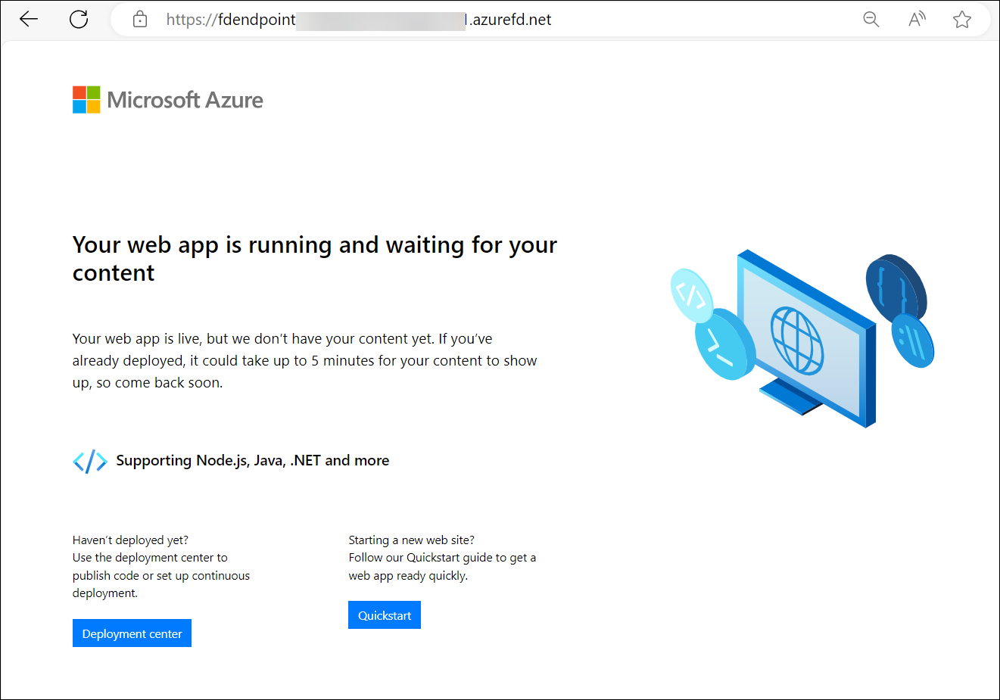
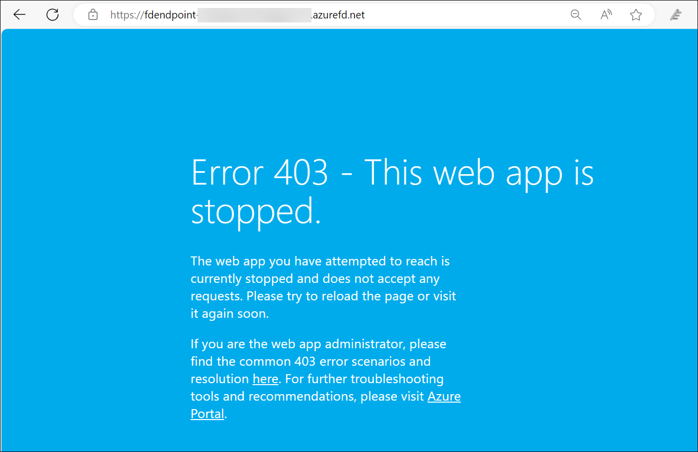

# Module 05: Unit 6 Create a Front Door for a highly available web application using the Azure portal

## Lab scenario
In this lab, you will set up an Azure Front Door configuration that pools two instances of a web application that runs in different Azure regions. This configuration directs traffic to the nearest site that runs the application. Azure Front Door continuously monitors the web application. You will demonstrate automatic failover to the next available site when the nearest site is unavailable. The network configuration is shown in the following diagram:

## Lab objectives
In this lab, you will complete the following tasks:

+ Task 1: Create two instances of a web app
+ Task 2: Create a Front Door for your application
+ Task 3: View Azure Front Door in action

**Note:** An **[interactive lab simulation](https://mslabs.cloudguides.com/guides/AZ-700%20Lab%20Simulation%20-%20Create%20a%20Front%20Door%20profile%20for%20a%20highly%20available%20web%20application)** is available that allows you to click through this lab at your own pace. You may find slight differences between the interactive simulation and the hosted lab, but the core concepts and ideas being demonstrated are the same.

## Estimated time: 30 minutes

## Architecture diagram

## Task 1: Create two instances of a web app

This exercise requires two instances of a web application that run in different Azure regions. Both the web application instances run in Active/Active mode, so either one can take traffic. This configuration differs from an Active/Stand-By configuration, where one acts as a failover.

1. On any Azure Portal page, in **Search resources, services and docs (G+/)**, enter **WebApp**, and then select **App Services** under services.

   

1. Select **+ Create**  and then select **Web App** to create a Web App.

     

1. On the Create Web App page, on the **Basics** tab, enter or select the following information.

   | **Setting**      | **Value**                                                    |
   | ---------------- | ------------------------------------------------------------ |
   | Subscription     | Select your subscription.                                    |
   | Resource group   | Select **ContosoResourceGroup-<inject key="DeploymentID" enableCopy="false"/>**                |
   | Name             | **WebAppContoso-1-<inject key="DeploymentID" enableCopy="false"/>** |
   | Publish          | Select **Code**.                                             |
   | Runtime stack    | Select **.NET 6 (LTS)**.                                     |
   | Operating System | Select **Windows**.                                          |
   | Region           | Select **Central US**.                                       |
   | Windows Plan     | Select **Create new** and enter **myAppServicePlanCentralUS** in the text box. |
   | Princing Plan    | Select **Standard S1 100 total ACU, 1.75 GB memory**.        |
   |||

   
   
1. Select **Review + create**, review the Summary, and then select **Create**.   
   ‎It might take 2 minutes for the deployment to complete.

1. Create a second web app, on the Azure Portal home page, search  **WebApp**.

1. Select **+ Create** to create a Web App.

1. On the Create Web App page, on the **Basics** tab, enter or select the following information.

   | **Setting**      | **Value**                                                    |
   | ---------------- | ------------------------------------------------------------ |
   | Subscription     | Select your subscription.                                    |
   | Resource group   | Select **ContosoResourceGroup-<inject key="DeploymentID" enableCopy="false"/>**               |
   | Name             | **WebAppContoso-2-<inject key="DeploymentID" enableCopy="false"/>** |
   | Publish          | Select **Code**.                                             |
   | Runtime stack    | Select **.NET 6 (LTS)**.                                     |
   | Operating System | Select **Windows**.                                          |
   | Region           | Select **East US**.                                          |
   | Windows Plan     | Select **Create new** and enter **myAppServicePlanEastUS** in the text box. |
   | Pricing Plan     | Select **Standard S1 100 total ACU, 1.75 GB memory**.        |
   |||

   
   
1. Select **Review + create**, review the Summary, and then select **Create**.   
   ‎It might take several minutes for the deployment to complete.

   > **Congratulations** on completing the task! Now, it's time to validate it. Here are the steps:
   > - Navigate to the Lab Validation Page, from the upper right corner in the lab guide section.
   > - Hit the Validate button for the corresponding task. You can proceed to the next task if you receive a success message.
   > - If not, carefully read the error message and retry the step, following the instructions in the lab guide.
   > - If you need any assistance, please contact us at labs-support@spektrasystems.com. We are available 24/7 to help you out.

## Task 2: Create a Front Door for your application

Configure Azure Front Door to direct user traffic based on lowest latency between the two web apps servers. To begin, add a frontend host for Azure Front Door.

1. On any Azure Portal page, in **Search resources, services and docs (G+/)**, Search for Front Door and CDN profiles, and then select **Front Door and CDN profiles**.

   
   
1. On the **Front Door and CDN profiles** page, select **+ Create**.

1. On the Compare offerings page, select **Quick create**. Then select **Continue to create a Front Door**.

    

1. On the Basics tab, enter or select the following information.

      | **Setting**             | **Value**                                    |
      | ----------------------- | -------------------------------------------- |
      | Subscription            | Select your subscription.                    |
      | Resource group          | Select **ContosoResourceGroup-<inject key="DeploymentID" enableCopy="false"/>**                  |
      | Resource group location | Accept default setting                       |
      | Name                    | **FrontDoor<inject key="DeploymentID" enableCopy="false"/>**   |
      | Tier                    | Standard   |
      | Endpoint Name           | FDendpoint   |
      | Origin Type             | App Service | 
      | Origin host name        | **WebAppContoso-1-<inject key="DeploymentID" enableCopy="false"/>** |
      |||

      

1. Select **Review and Create**, and then select **Create**.

1. Wait for the resource to deploy, and then select **Go to resource**.

1. On the Front Door resource in the Overview blade, locate the **Origin Groups**, to update select the origin group **default-origin-group** from the list and click on **Add an origin**

   

1. On the **Add on Origin** window, add the following information and select **Add**.

   
   | **Setting**             | **Value**                                    |
   | ----------------------- | -------------------------------------------- |
   | Name                    | **default-origin-group**                         |
   | Origin type             | **App service**                                  |
   | Host name               | Select **WebAppContoso-2-<inject key="DeploymentID" enableCopy="false"/>** |
   | Origin host header      | Select **WebAppContoso-2-<inject key="DeploymentID" enableCopy="false"/>** |
   |||
   
   

   
1. Select **Update**.

   .png)

   > **Congratulations** on completing the task! Now, it's time to validate it. Here are the steps:
   > - Navigate to the Lab Validation Page, from the upper right corner in the lab guide section.
   > - Hit the Validate button for the corresponding task. You can proceed to the next task if you receive a success message.
   > - If not, carefully read the error message and retry the step, following the instructions in the lab guide.
   > - If you need any assistance, please contact us at labs-support@spektrasystems.com. We are available 24/7 to help you out.

 ## Task 3: View Azure Front Door in action

Once you create a Front Door, it takes a few minutes for the configuration to be deployed globally. Once complete, access the frontend host you created. 

1. Navigate back to **Front Door and CDN profiles** page, on the Front Door resource in the Overview blade, locate the endpoint hostname that is created for your endpoint. This should be fdendpoint followed by a hyphen and a random string. For example, **fdendpoint-fxa8c8hddhhgcrb9.z01.azurefd.net**. **Copy** this FQDN.

   

1. In a new browser tab, navigate to the Front Door endpoint FQDN. The default App Service page will be displayed.
   
    

1. To test instant global failover in action, try the following steps:

1. Switch to the Azure portal, search for and select **App services**. 

1. Select one of your web apps, then select **Stop**, and then select **Yes** to verify.

    

1. Switch back to your browser and select Refresh. You should see the same information page.

    **Note**: There may be a delay while the web app stops. If you get an error page in your browser, refresh the page.

1. Switch back to the Azure Portal, locate the other web app, and stop it.

1. Switch back to your browser and select Refresh. This time, you should see an error message.

    

   Congratulations! You have configured and tested an Azure Front Door.

### Review
In this lab, you have completed:

- Create two instances of a web app
- Create a Front Door for your application
- View Azure Front Door in action
  
## You have successfully completed the lab.

