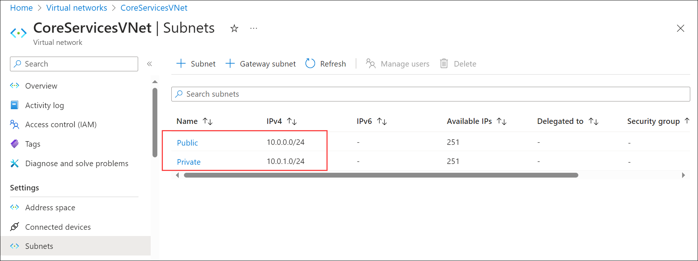
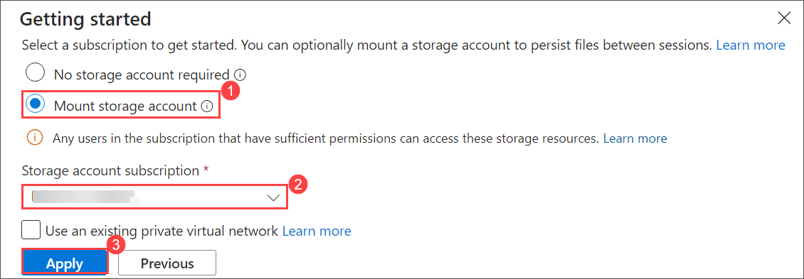
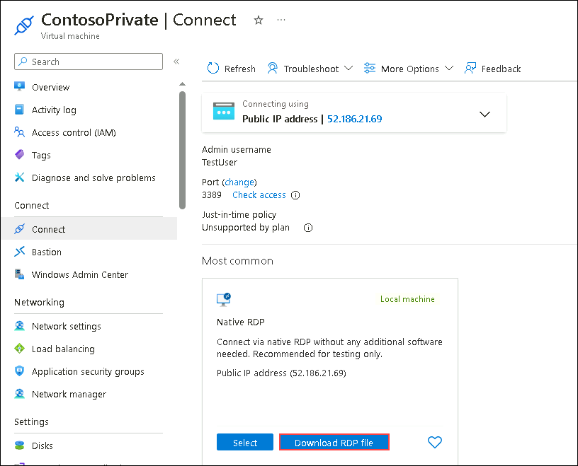
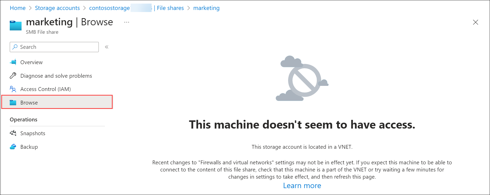

# Module 07-Unit 5 Restrict network access to PaaS resources with virtual network service endpoints

## Lab scenario 
Virtual network service endpoints enable you to limit network access to some Azure service resources to a virtual network subnet. You can also remove internet access to the resources. Service endpoints provide direct connection from your virtual network to supported Azure services, allowing you to use your virtual network's private address space to access the Azure services. Traffic destined to Azure resources through service endpoints always stays on the Microsoft Azure backbone network.

**Note:** An **[interactive lab simulation](https://mslabs.cloudguides.com/guides/AZ-700%20Lab%20Simulation%20-%20Restrict%20network%20access%20to%20PaaS%20resources%20with%20virtual%20network%20service%20endpoints)** is available that allows you to click through this lab at your own pace. You may find slight differences between the interactive simulation and the hosted lab, but the core concepts and ideas being demonstrated are the same.


## Lab Objectives
  
In this lab, you will complete the following tasks:

+ Task 1: Create a virtual network
+ Task 2: Enable a service endpoint
+ Task 3: Restrict network access for a subnet
+ Task 4: Add additional outbound rules 
+ Task 5: Allow access for RDP connections
+ Task 6: Restrict network access to a resource
+ Task 7: Create a file share in the storage account
+ Task 8: Restrict network access to a subnet
+ Task 9: Create virtual machines
+ Task 10: Confirm access to storage account
+ Task 11: Confirm access is denied to storage account

## Estimated time: 35 minutes

## Architecture Diagram

  ‎

## Task 1: Create a virtual network

1. On Azure Portal page, in **Search resources, services and docs (G+/)** box at the top of the portal, enter **Virtual network**, and then select **Virtual 
   network** under services.

1. Select **+ Create**.

1. On the **Create virtual network** blade specify the following information:
 
   | **Setting**    | **Value**                                     |
   | -------------- | --------------------------------------------- |
   | Subscription   | Select your subscription                      |
   | Resource group | Select **myResourceGroup**                               |
   | Name           | **CoreServicesVNet**                              |
   | Location       | Select **<inject key="Region" enableCopy="false"/>**                     |

1. Select **Next** and in the  **Security** tab, and specify the following values:

   | **Setting**             | **Value** |
   | ----------------------- | --------- |
   | BastionHost             | Disabled  |
   | DDoS Network Protection | Disabled  |
   | Firewall                | Disabled  |

1. Select **Next** and in the **IP Addresses** tab and select **default** to change the subnet name, specify the following values:

   | **Setting**          | **Value**   |
   | -------------------- | ----------- |
   | Subnet Name          | Public      |
   | Starting address     | 10.0.0.0    |
   | Subnet size          | /24 |

1. Select **Save**.
   
1. Select **Review + Create**. Once the resource is validated select **Create**.

   > **Congratulations** on completing the task! Now, it's time to validate it. Here are the steps:
   > - Navigate to the Lab Validation Page, from the upper right corner in the lab guide section.
   > - Hit the Validate button for the corresponding task. You can proceed to the next task if you receive a success message.
   > - If not, carefully read the error message and retry the step, following the instructions in the lab guide.
   > - If you need any assistance, please contact us at labs-support@spektrasystems.com. We are available 24/7 to help you out.

## Task 2: Enable a service endpoint

Service endpoints are enabled per service, per subnet. Create a subnet and enable a service endpoint for the subnet.

1. In the **Search resources, services, and docs** box at the top of the portal, enter **CoreServicesVNet**. When CoreServicesVNet appears in the search results, select 
   it.

1. Add a subnet to the virtual network. Under **Settings**, select **Subnets**, and then select **+ Subnet**, as shown in the following picture:
   
    

1. Under **Add subnet**, select or enter the following information:

   | **Setting**                 | **Value**                    |
   | --------------------------- | ---------------------------- |
   | Name                        | Private                      |
   | Subnet address range        | 10.0.1.0/24                  |
   | Service endpoints: Services | Select **Microsoft.Storage** |

1. Select **Save**.

1. You should now have two subnets configured:

   

   > **Congratulations** on completing the task! Now, it's time to validate it. Here are the steps:
   > - Navigate to the Lab Validation Page, from the upper right corner in the lab guide section.
   > - Hit the Validate button for the corresponding task. You can proceed to the next task if you receive a success message.
   > - If not, carefully read the error message and retry the step, following the instructions in the lab guide.
   > - If you need any assistance, please contact us at labs-support@spektrasystems.com. We are available 24/7 to help you out.

## Task 3: Restrict network access for a subnet

By default, all VMs in a subnet can communicate with all resources. You can limit communication to and from all resources in a subnet by creating a network security group and associating it to the subnet.

1. On Azure Portal page, in **Search resources, services and docs (G+/)** box at the top of the portal, enter **security group**. When **Network Security groups** 
   appears in the search results, select it.

1. In Network security groups, select **+ Create**. 

1. Enter or select, the following information: 

    | **Setting**    | **Value**                                                    |
    | -------------- | ------------------------------------------------------------ |
    | Subscription   | Select your subscription                                     |
    | Resource group | Select **myResourceGroup**                                              |
    | Name           | **ContosoPrivateNSG**                                            |
    | Location       | Select **<inject key="Region" enableCopy="false"/>**                                           |

1. Select **Review + create**, then select **Create**.

1. After the ContosoPrivateNSG network security group is created, select **Go to resource**.

1. On the **ContosoPrivateNSG** page, from the left navigation menu, under **Settings** section, select **Outbound security rules**.

1. Select **+ Add**.

1. Create a rule that allows outbound communication to the Azure Storage service. Enter, or select, the following information:
  
    | **Setting**             | **Value**                 |
    | ----------------------- | ------------------------- |
    | Source                  | Select **Service Tag**    |
    | Source service tag      | Select **VirtualNetwork** |
    | Source port ranges      | *                         |
    | Destination             | Select **Service Tag**    |
    | Destination service tag | Select **Storage**        |
    | Service                 | Custom                    |
    | Destination port ranges | *                         |
    | Protocol                | Any                       |
    | Action                  | Allow                     |
    | Priority                | 100                       |
    | Name                    | Allow-Storage-All         |

1. Select **Add**.

   > **Congratulations** on completing the task! Now, it's time to validate it. Here are the steps:
   > - Navigate to the Lab Validation Page, from the upper right corner in the lab guide section.
   > - Hit the Validate button for the corresponding task. You can proceed to the next task if you receive a success message.
   > - If not, carefully read the error message and retry the step, following the instructions in the lab guide.
   > - If you need any assistance, please contact us at labs-support@spektrasystems.com. We are available 24/7 to help you out.

## Task 4: Add additional outbound rules 

Create another outbound security rule that denies communication to the internet. This rule overrides a default rule in all network security groups that allows outbound internet communication. 

1. Select **+ Add** under **Outbound security rules**.

1. Enter, or select, the following information:
 
   | **Setting**             | **Value**                 |
   | ----------------------- | ------------------------- |
   | Source                  | Select **Service Tag**    |
   | Source service tag      | Select **VirtualNetwork** |
   | Source port ranges      | *                         |
   | Destination             | Select **Service Tag**    |
   | Destination service tag | Select **Internet**       |
   | Service                 | Custom                    |
   | Destination port ranges | *                         |
   | Protocol                | Any                       |
   | Action                  | Deny                      |
   | Priority                | 110                       |
   | Name                    | Deny-Internet-All         |

1. Select **Add**.

   > **Congratulations** on completing the task! Now, it's time to validate it. Here are the steps:
   > - Navigate to the Lab Validation Page, from the upper right corner in the lab guide section.
   > - Hit the Validate button for the corresponding task. You can proceed to the next task if you receive a success message.
   > - If not, carefully read the error message and retry the step, following the instructions in the lab guide.
   > - If you need any assistance, please contact us at labs-support@spektrasystems.com. We are available 24/7 to help you out.

## Task 5: Allow access for RDP connections

Create an inbound security rule that allows Remote Desktop Protocol (RDP) traffic to the subnet from anywhere. The rule overrides a default security rule that denies all inbound traffic from the internet. Remote desktop connections are allowed to the subnet so that connectivity can be tested in a later step.

1. On ContosoPrivateNSG | Outbound security rules, from left navigation menu, under **Settings**, select **Inbound security rules**.

1. Select **+ Add**.

1. In Add inbound security rule, enter the following values::

   | **Setting**             | **Value**                 |
   | ----------------------- | ------------------------- |
   | Source                  | Any                       |
   | Source port ranges      | *                         |
   | Destination             | Select **Service Tag**    |
   | Destination service tag | Select **VirtualNetwork** |
   | Service                 | Custom                    |
   | Destination port ranges | 3389                      |
   | Protocol                | Any                       |
   | Action                  | Allow                     |
   | Priority                | 120                       |
   | Name                    | Allow-RDP-All             |

1. Select **Add**.

   > **Warning**: RDP port 3389 is exposed to the Internet. This is only recommended for testing. For production environments, we recommend using a VPN or private connection.

1. From the left navigation menu, under **Settings**, select **Subnets**.

1. Select **+ Associate.**

1. Under **Associate subnet**, from the **Virtual network** dropdown select **CoreServicesVNet**.

1. Under **Subnet**, select **Private**, and then select **OK**.

   > **Congratulations** on completing the task! Now, it's time to validate it. Here are the steps:
   > - Navigate to the Lab Validation Page, from the upper right corner in the lab guide section.
   > - Hit the Validate button for the corresponding task. You can proceed to the next task if you receive a success message.
   > - If not, carefully read the error message and retry the step, following the instructions in the lab guide.
   > - If you need any assistance, please contact us at labs-support@spektrasystems.com. We are available 24/7 to help you out.

## Task 6: Restrict network access to a resource

The steps necessary to restrict network access to resources created through Azure services enabled for service endpoints varies across services. See the documentation for individual services for specific steps for each service. The remainder of this exercise includes steps to restrict network access for an Azure Storage account, as an example.

1. On Azure Portal page, in **Search resources, services and docs (G+/)** box at the top of the portal, enter **Storage Account**, and then select **Storage Account** under services.

1. Select **+ Create**.

1. Enter, or select, the following information and accept the remaining defaults:

    | **Setting**    | **Value**                                                    |
    | -------------- | ------------------------------------------------------------ |
    | Subscription   | Select your subscription                                     |
    | Resource group | myResourceGroup                                              |
    | Region         | **<inject key="Region" enableCopy="false"/>** 
    | Name           | Enter **contosostorage<inject key="DeploymentID" enableCopy="false"/>** |
    | Performance    | Standard                      |                                              |
    | Redundancy    | Locally-redundant storage (LRS)                              |

1. Select **Review + create**, then select **Create**.

   > **Congratulations** on completing the task! Now, it's time to validate it. Here are the steps:
   > - Navigate to the Lab Validation Page, from the upper right corner in the lab guide section.
   > - Hit the Validate button for the corresponding task. You can proceed to the next task if you receive a success message.
   > - If not, carefully read the error message and retry the step, following the instructions in the lab guide.
   > - If you need any assistance, please contact us at labs-support@spektrasystems.com. We are available 24/7 to help you out.

## Task 7: Create a file share in the storage account

1. On Azure Portal page, in **Search resources, services and docs (G+/)** box at the top of the portal, enter **Storage Account**, and then select **Storage 
   Account** under services.

1. From the list select **contosostorage<inject key="DeploymentID" enableCopy="false"/>** storage account.

1. From left navigation pane of storage account under **Data storage**, select **File shares**, 
   
1. Select **+ File share**.

1. Enter **marketing**, under **Name**.

1. Select **Next: Backup >** and unselect the **Enable backup**.
   
1. Select **Review + create** and **Create**.

   > **Congratulations** on completing the task! Now, it's time to validate it. Here are the steps:
   > - Navigate to the Lab Validation Page, from the upper right corner in the lab guide section.
   > - Hit the Validate button for the corresponding task. You can proceed to the next task if you receive a success message.
   > - If not, carefully read the error message and retry the step, following the instructions in the lab guide.
   > - If you need any assistance, please contact us at labs-support@spektrasystems.com. We are available 24/7 to help you out.

## Task 8: Restrict network access to a subnet

By default, storage accounts accept network connections from clients in any network, including the internet. Deny network access from the internet, and all other subnets in all virtual networks, except for the Private subnet in the CoreServicesVNet virtual network.

1. On **contosostorage<inject key="DeploymentID" enableCopy="false"/>** storage account blade.

1. From the left navigation pane, under **Security + networking** section, select **Networking (1)**.

1. Select **Enabled from selected virtual networks and IP addresses (2)**.

1. Select **+ Add existing virtual network (3)**.

1. Under **Add networks**, select the following values and select **Add (7)**. 
   
   | **Setting**      | **Value**                    |
   | ---------------- | ---------------------------- |
   | Subscription     | Select your subscription (4).    |
   | Virtual networks | Select **CoreServicesVNet (5)**  |
   | Subnets          | Select **Private (6)**.          |
   |||
   
   

1. Select **Save**.

1. Under **Security + networking** for the storage account, select **Access keys**.

1. Select **Show Keys**. make a note the **Key** value, as you'll have to manually enter it in a later step when mapping the file share to a drive letter in a VM.

## Task 9: Create virtual machines

To test network access to a storage account, deploy a VM to each subnet.

1. On the Azure portal, select the **Cloud shell** (**[>_]**)  button at the top of the page to the right of the search box. This opens a cloud shell pane at the bottom of the portal.

   

1. The first time you open the Cloud Shell, you may be prompted to choose the type of shell you want to use (*Bash* or *PowerShell*). If so, select **PowerShell**.

   

1. On **Getting started** window choose **Mount storage account** then under **Storage account subscription** select your available subscription from the dropdown and click on **Apply**.
   
     
   
1. Within the Mount storage account pane, select **I want to create a storage account** and click **Next**.

     

1. Please make sure you have selected your resource group **myResourceGroup** and then select **Region** **<inject key="Region" enableCopy="false"/>** and enter **blob<inject key="DeploymentID" enableCopy="false"/>** for the **Storage account name** and enter **blobfileshare<inject key="DeploymentID" enableCopy="false"/>** for the  **File share** , then click on **Create**.

1. On the toolbar of the Cloud Shell pane, select the Select **Manage files** icon, in the drop-down menu, select **Upload** and upload the following files **VMs.json** and **VMs.parameters.json** into the Cloud Shell home directory one by one from the source folder **C:\AllFiles\AZ-700-Designing-and-Implementing-Microsoft-Azure-Networking-Solutions-prod\Allfiles\Exercises\M07**.

     
   
1. Deploy the following ARM templates to create the VMs needed for this exercise:

   ```powershell
   $RGName = "myResourceGroup"
   
   New-AzResourceGroupDeployment -ResourceGroupName $RGName -TemplateFile VMs.json -TemplateParameterFile VMs.parameters.json
   ```

   **Note**: You will be prompted to provide an Admin password, enter **Pa55w.rd!!**.

1. When the deployment is complete, go to the Azure portal home page, and then select **Virtual Machines** to find the newly created virtual machines.

   > **Congratulations** on completing the task! Now, it's time to validate it. Here are the steps:
   > - Navigate to the Lab Validation Page, from the upper right corner in the lab guide section.
   > - Hit the Validate button for the corresponding task. You can proceed to the next task if you receive a success message.
   > - If not, carefully read the error message and retry the step, following the instructions in the lab guide.
   > - If you need any assistance, please contact us at labs-support@spektrasystems.com. We are available 24/7 to help you out.

## Task 10: Confirm access to storage account

1. On the **Virtual Machine** blade, select **ContosoPrivate** VM and click on **Connect** and from the dropdown click on **Connect** again.

1. On **ContosoPrivate | Connect** page, under **Native RDP** click on **Select** and on **Native RDP** box select **Download RDP file**. 

   
   
1. Open the downloaded rdp file. If prompted, select Connect. Enter the user name **TestUser** and password **Pa55w.rd!!**.

   >**Note:** Ignore the warning and click on **Keep** to open the downloaded RDP file.

1. Select **OK**.

1. You may receive a certificate warning during the sign-in process. If you receive the warning, select **Yes** to proceed with the connection.

1. On the **ContosoPrivate** VM, from the start menu open the **windows powershell**.

   >**Note:** In the pop-up related to network visibility click **No**.

1. On the ContosoPrivate VM, map the Azure file share to drive Z using PowerShell. Before running the commands that follow, replace **[storage-account-key]** that you noted in eariler task.

     ```azurecli
     $acctKey = ConvertTo-SecureString -String "[storage-account-key]" -AsPlainText -Force
     
     $credential = New-Object System.Management.Automation.PSCredential -ArgumentList "Azure\contosostorage<inject key="DeploymentID" enableCopy="false"/>", $acctKey
     
     New-PSDrive -Name Z -PSProvider FileSystem -Root "\\contosostorage<inject key="DeploymentID" enableCopy="false"/>.file.core.windows.net\marketing" -Credential $credential
     
     ```

   >**Note**: The Azure file share successfully mapped to the Z drive.

1. Confirm that the VM has no outbound connectivity to the internet from a command prompt:

   **ping bing.com**

   >**Note**: You receive no replies because the network security group associated to the Private subnet does not allow outbound access to the internet.

1. Close the remote desktop session to the ContosoPrivate VM.

## Task 11: Confirm access is denied to storage account

1. Enter ContosoPublic in **Search resources, services and docs (G+/)**, box at the top of the portal.

1. When **ContosoPublic** appears in the search results, select it.

1. Complete steps 1-7 of previous task to get Confirm access to storage account task for the ContosoPublic VM.  
     
1. ‎After a short wait, you receive a New-PSDrive : Access is denied error. Access is denied because the ContosoPublic VM is deployed in the Public subnet. The Public subnet does not have a service endpoint enabled for Azure Storage. The storage account only allows network access from the Private subnet, not the Public subnet.

   

1. Confirm that the public VM does have outbound connectivity to the internet from a command prompt:

   **ping bing.com**   

1. Close the remote desktop session to the ContosoPublic VM.

1. From your computer, browse to the Azure portal.

1. On Azure Portal page, in **Search resources, services and docs (G+/)**, enter **Storage account**, and then select **Storage account** under services.

1. Select **contosostorage<inject key="DeploymentID" enableCopy="false"/>**.

1. From left navigation pane of storage account under **Data storage**, select **File shares**, 

1. Select **File shares** then select the **marketing** file share.

1. On the **marketing** blade, from the left navigation menu, click on **Browse**

1. You receive the error shown in the following screenshot:

   

   **Note**:  Access is denied, because your computer is not in the Private subnet of the CoreServicesVNet virtual network.

   **Warning**: Prior to continuing you should remove all resources used for this lab. To do this On the Azure portal select Resource groups. Select any resources groups you have created. On the resource group blade select Delete Resource group, enter the Resource Group Name and select Delete. Repeat the process for any additional Resource Groups you may have created. Failure to do this may cause issues with other labs.

## Review
In this lab, you have completed:

+ Create a virtual network
+ Enable a service endpoint
+ Restrict network access for a subnet
+ Add additional outbound rules 
+ Allow access for RDP connections
+ Restrict network access to a resource
+ Create a file share in the storage account
+ Restrict network access to a subnet
+ Create virtual machines
+ Confirm access to storage account
+ Confirm access is denied to storage account

## You have successfully completed the lab.
