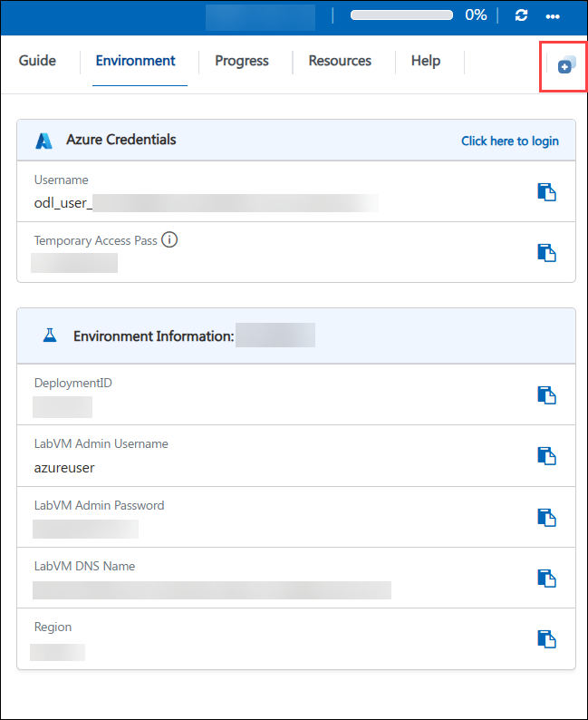
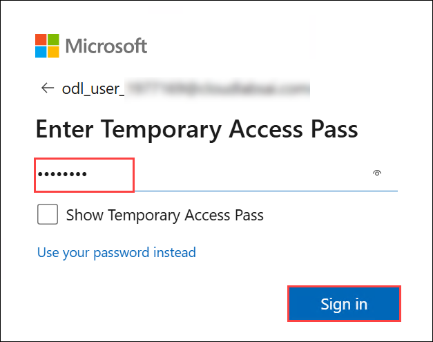
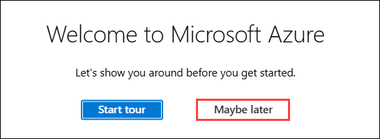

# Getting Started with Your AZ-700: Designing and Implementing Microsoft Azure Networking Solutions Workshop
 
Welcome to your AZ-700: Designing and Implementing Microsoft Azure Networking Solutions workshop! We've prepared a seamless environment for you to explore and learn about planning, implementing, and managing Azure networking solutions. Let's begin by making the most of this experience:

## Overview

In these hands-on labs, you will develop the skills required to design, implement, secure, and monitor Microsoft Azure networking solutions. Working as an Azure Network Engineer for the fictional Contoso Ltd, you will build and connect virtual networks across regions, configure private name resolution with Azure DNS, and establish hybrid and inter-network connectivity using VNet peering, VPN gateways, Azure Virtual WAN, and ExpressRoute. You will design highly available applications using Azure Load Balancer, Azure Traffic Manager, and Azure Application Gateway, and secure your network perimeter with Azure DDoS Protection, Azure Firewall, and Azure Firewall Manager. The labs also cover restricting access to Azure PaaS resources with virtual network service endpoints and private endpoints, and monitoring network resource health and performance using Azure Monitor. By completing these labs, you will gain the practical, hands-on experience needed to design, implement, and manage secure, scalable, and highly available Azure networking solutions.

## Objectives

By the end of these labs, you will be able to:

1. **Design and implement virtual networks:** Create and configure virtual networks and subnets including CoreServicesVnet, ManufacturingVnet, and ResearchVnet to support segmented, scalable network architectures.

2. **Configure Azure DNS:** Create and link Azure Private DNS zones to virtual networks, enable auto-registration, and verify private name resolution between virtual machines.

3. **Connect virtual networks:** Implement global virtual network peering, Site-to-Site and VNet-to-VNet VPN gateway connections, and Azure Virtual WAN hubs to connect and route traffic between distributed virtual networks.

4. **Implement ExpressRoute connectivity:** Configure an ExpressRoute gateway and provision, retrieve the service key for, and deprovision an ExpressRoute circuit to enable private, high-speed connections between on-premises networks and Azure.

5. **Design and configure load-balancing solutions:** Deploy and configure an internal Azure Load Balancer with backend pools, health probes, and load-balancing rules; create an Azure Traffic Manager profile for priority-based failover routing; and deploy an Azure Application Gateway for Layer 7 web traffic load balancing.

6. **Secure the network perimeter:** Configure Azure DDoS Protection on a virtual network, deploy and configure Azure Firewall with application, network, and DNAT rules, and secure a virtual hub using Azure Firewall Manager in a hub-and-spoke topology.

7. **Restrict access to PaaS resources:** Configure virtual network service endpoints and network security group rules to restrict access to an Azure Storage account, and create an Azure Private Endpoint to securely connect to an Azure Web App over Azure Private Link.

8. **Monitor and troubleshoot network resources:** Use Azure Monitor, Log Analytics workspaces, and Network Insights (Functional Dependency View, detailed metrics, and resource health) to monitor and diagnose the health and performance of an Azure Load Balancer.

9. **Automate network infrastructure deployment:** Use Azure PowerShell, and Azure Cloud Shell to provision virtual networks, virtual machines, and other networking resources consistently and repeatably.

## Pre-requisites

- Experience with Azure administration and networking concepts.
- Proficiency with Azure PowerShell and Azure CLI is recommended.
- Familiarity with TCP/IP addressing and subnetting, DNS, VPN, and hybrid network connectivity concepts will help learners get the most from this course.

## Architecture

The lab architecture demonstrates how Azure's networking services work together to connect, secure, load balance, and monitor enterprise workloads across regions and on-premises networks. Throughout these labs, you will provision virtual networks, establish inter-network and hybrid connectivity, distribute traffic across backend resources, secure network boundaries, and monitor network health.

1. **Core Networking Services:** Azure Virtual Network, subnets, and Azure DNS provide the foundational address space, network segmentation, and private name resolution for all Contoso workloads across the CoreServicesVnet, ManufacturingVnet, and ResearchVnet.

2. **Hybrid and Inter-Network Connectivity Services:** VNet peering, VPN Gateway, Azure Virtual WAN, and Azure ExpressRoute connect virtual networks to each other and to on-premises networks over private, reliable connections.

3. **Load Balancing and Traffic Delivery Services:** Azure Load Balancer, Azure Traffic Manager, and Azure Application Gateway distribute traffic across backend virtual machines and web applications to deliver high availability and scalability at Layer 4 and Layer 7.

4. **Network Security Services:** Azure DDoS Protection, Azure Firewall, and Azure Firewall Manager protect virtual networks from volumetric attacks and control inbound/outbound traffic using application, network, and NAT rules.

5. **Private Access Services:** Virtual network service endpoints and Azure Private Endpoints restrict and secure access to Azure PaaS resources, such as Azure Storage and Azure Web Apps, keeping traffic on the Microsoft backbone network.

6. **Monitoring and Management Tools:** Azure Monitor, Log Analytics workspaces, Network Insights, Azure Portal, Azure PowerShell, and Azure Cloud Shell are used to provision infrastructure, deploy ARM/Bicep templates, and monitor and troubleshoot networking resources throughout the labs.

## Explanation of Components

1. **Azure Virtual Network & Subnets:** Provide the fundamental private network building block in Azure, enabling resources such as virtual machines to securely communicate with each other, the internet, and on-premises networks through segmented address spaces.

2. **Azure DNS:** Hosts and manages DNS domains and records for name resolution, allowing Azure resources within linked virtual networks to automatically register and resolve private DNS names.

3. **Virtual Network Peering:** Connects two or more virtual networks within a region or globally across regions so resources communicate directly over the Microsoft backbone network without a gateway or public internet exposure.

4. **VPN Gateway:** Provides secure connectivity between Azure virtual networks and other Azure virtual networks (VNet-to-VNet) or on-premises networks (Site-to-Site) using IPsec/IKE VPN tunnels.

5. **Azure Virtual WAN:** Brings networking, security, and routing functionality together in a hub-and-spoke architecture, enabling large-scale branch, VPN, and ExpressRoute connectivity through centrally managed virtual hubs.

6. **Azure ExpressRoute :** Extends on-premises networks into the Microsoft cloud over a private, dedicated, high-bandwidth connection provided by a connectivity partner, bypassing the public internet.

7. **Azure Load Balancer:** Distributes inbound traffic across a pool of backend virtual machines based on load-balancing rules and health probes, supporting both public and internal (private) load-balancing scenarios.

8. **Azure Traffic Manager:** A DNS-based traffic load balancer that distributes traffic across endpoints in different Azure regions using routing methods such as priority, enabling automatic failover for high availability.

9. **Azure Application Gateway:** A Layer 7 web traffic load balancer that uses listeners, routing rules, and backend pools to route HTTP/HTTPS traffic to web application backends.

10. **Azure DDoS Protection:** Defends virtual networks against Distributed Denial-of-Service (DDoS) attacks with always-on traffic monitoring, adaptive tuning, and telemetry and alerting.

11. **Azure Firewall & Firewall Manager:** A managed, cloud-based network firewall that inspects and filters traffic using application, network, and DNAT rules; Firewall Manager centrally deploys and manages security policies across secured virtual hubs in a hub-and-spoke topology.

12. **Virtual Network Service Endpoints & Private Endpoints:** Service endpoints extend a virtual network's identity to Azure PaaS services to keep traffic on the Azure backbone, while Private Endpoints assign a private IP address from the VNet directly to a PaaS service such as an Azure Web App.

13. **Azure Monitor & Log Analytics:** Collects metrics, logs, and diagnostic data from networking resources such as load balancers, and provides Network Insights for monitoring and troubleshooting.

## Accessing Your Lab Environment
 
Once you're ready to dive in, your virtual machine and lab guide will be right at your fingertips within your web browser.
 

### Virtual Machine & Lab Guide
 
Your virtual machine is your workhorse throughout the workshop. The lab guide is your roadmap to success.
 
## Exploring Your Lab Resources
 
To get a better understanding of your lab resources and credentials, navigate to the **Environment** tab.
 

## Lab Guide Zoom In/Zoom Out
 
To adjust the zoom level for the environment page, click the **A↕ : 100%** icon located next to the timer in the lab environment.

 
## Utilizing the Split Window Feature
 
For convenience, you can open the lab guide in a separate window by selecting the **Split Window** button from the Top right corner.
 

 
## Managing Your Virtual Machine
 
Feel free to **Start**, **Stop**, or **Restart** your virtual machine as needed from the **Resources** tab. Your experience is in your hands!
 

## Lab Duration Extension

1. To extend the duration of the lab, kindly click the **Hourglass** icon in the top right corner of the lab environment. 

    

    >**Note:** You will get the **Hourglass** icon when 10 minutes are remaining in the lab.

2. Click **OK** to extend your lab duration.
 
   

3. If you have not extended the duration prior to when the lab is about to end, a pop-up will appear, giving you the option to extend. Click **OK** to proceed.

## Pasting Commands in the PowerShell/CloudShell Environment

Please make sure to use the CTRL+SHIFT+V or CTRL+V keys when pasting commands inside the PowerShell/CloudShell environment instead of right-clicking.

## Let's Get Started with Azure Portal
 
1. On your virtual machine, click on the Azure Portal icon as shown below:
 
   .png)

2. You'll see the **Sign into Microsoft Azure** tab. Here, enter your credentials:
 
   - **Email/Username:** <inject key="AzureAdUserEmail"></inject>
 
       
 
3. Next, provide your password:
 
   - **Password:** <inject key="AzureAdUserPassword"></inject>
 
     

1. If the pop-up **Stay signed in?** appears, click on **No**.

   .png)

1. If a **Welcome to Microsoft Azure** pop-up window appears, simply click **Maybe Later** to skip the tour.

   
 

## Support Contact
 
The CloudLabs support team is available 24/7, 365 days a year, via email and live chat to ensure seamless assistance at any time. We offer dedicated support channels tailored specifically for both learners and instructors, ensuring that all your needs are promptly and efficiently addressed.
 
Learner Support Contacts:
 
- Email Support: cloudlabs-support@spektrasystems.com
- Live Chat Support: https://cloudlabs.ai/labs-support

Click on Next from the lower right corner to move on to the next page.

   .png)

## Happy Learning !!
